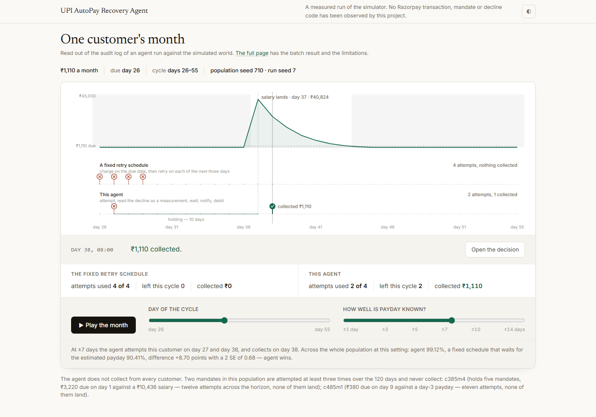
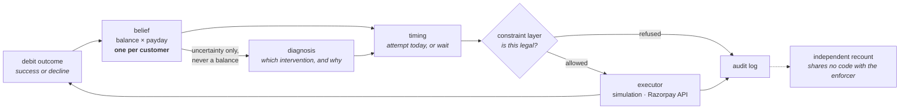
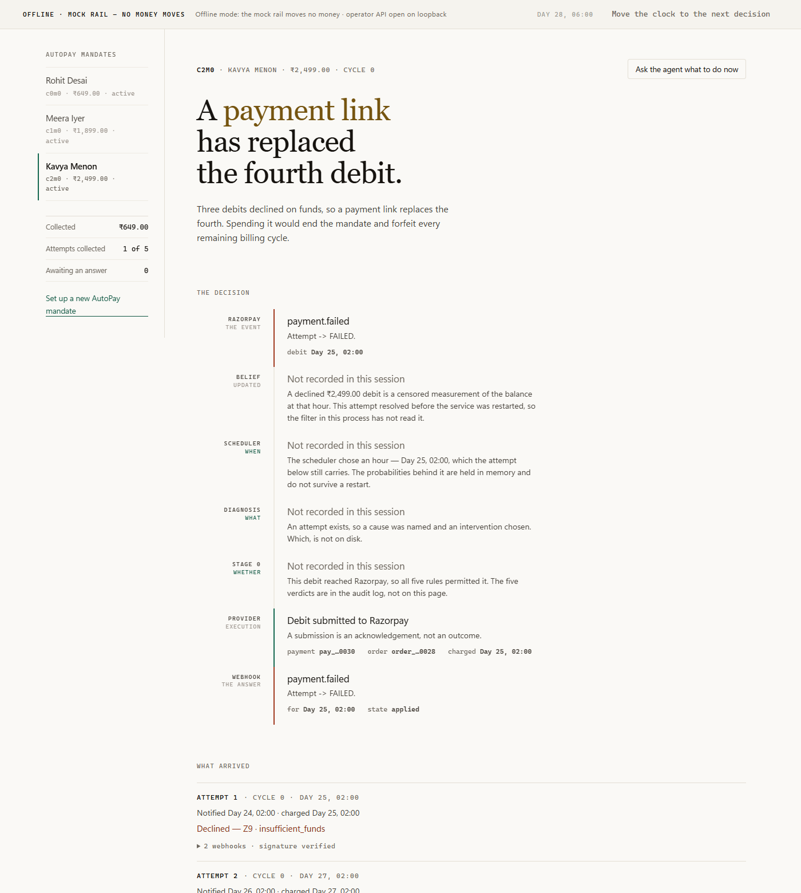

# UPI AutoPay Recovery Agent

An agent that schedules retries for failed subscription debits on UPI AutoPay.
It maintains a probability distribution over the customer's bank balance and
over the day their salary arrives, and attempts the debit when the balance is
likely to cover it.

[](LICENSE)
[](https://www.python.org/downloads/release/python-3120/)
[](https://tanmaybeginsjourney.github.io/mandate-retry-sequencer/)

**[▶ Play the demo](https://tanmaybeginsjourney.github.io/mandate-retry-sequencer/demo.html)** · [Full page](https://tanmaybeginsjourney.github.io/mandate-retry-sequencer/) · [Architecture](docs/architecture.md) · [Results](docs/results.md)



All results below are simulated. No Razorpay transaction, mandate or decline
code has been observed by this project.

## The problem

Indian subscription payments run on UPI AutoPay. A mandate authorises a merchant
to debit a customer once per billing cycle. If the account is short at the moment
of the charge, the debit is declined — and almost every decline is an empty
account rather than a broken instrument.

NPCI permits four attempts per mandate per cycle: one presentation and three
retries. Razorpay's documented schedule uses them on days T, T+1, T+2 and T+3,
then halts. That spends every attempt inside four days of the due date, which is
often before the customer is paid. A mandate that fails all four attempts dies
and forfeits its remaining billing cycles, so dunning harder costs the merchant
the customer.

The scarce resource is not attempts. It is information about when money arrives.

## Approach

Each decline is a measurement. A failed ₹550 debit proves the balance was below
₹550 at that hour; a successful one proves it was at least ₹550. These are
censored observations, and a Bayesian filter is the standard instrument for them.

Once a day, for each live mandate:

1. **Update the belief.** One distribution per customer covering the balance and
   which day of the 30-day cycle the salary lands. All of a customer's mandates
   share it, so an outcome on one subscription informs the timing of the others.
2. **Score today against later.** The belief gives the probability a debit clears
   tomorrow and the best probability on any remaining day of the cycle. A
   negative index score means waiting has higher expected value. On the last
   attempt a second test applies: spending it and failing kills the mandate, so
   it fires only when the odds cover the mandate's remaining cycles.
3. **Diagnose the failure.** A diagnosis layer assigns a root cause and selects an
   intervention — retry, nudge, escalate or stop — and writes the justification
   attached to the money action. In the batch runs this layer can be backed by a
   language model; **the live service constructs the deterministic rule engine
   and makes no model call.** Both satisfy the same port, and neither can choose
   an hour.
4. **Check the action against the mandate rules.** At most four attempts per
   mandate per cycle; no execution during peak hours; at least 24 hours between
   the pre-debit notification and the debit; one pending notification per
   mandate; no re-presentation of an insufficient-funds decline under the old
   notification.
5. **Execute or refuse.** Refused actions never reach an executor. After the
   first or second insufficient-funds decline a funding reminder is sent. After
   the third, a Payment Link replaces the fourth mandate debit, and that debit is
   not fired while the link is open or after it closes unpaid, so the mandate
   survives into the next cycle. Escalate appends a merchant-queue row.
6. **Record the outcome** in the belief, and **log the decision** — including the
   days on which nothing was attempted.



## What it collects

Two quantities are reported, with different denominators. **Cycle collection**
counts every billing cycle due, including those that never failed, and is this
project's metric because it prices mandate death. **Recovery** counts only the
debits that would have failed on their due date, and is what published industry
figures measure.

*Full agent mode, 10 held-out populations (seeds 710–719), run seed 7: 500
customers, mandates per customer drawn from `1 + Poisson(1)` capped at 8, 120
days, `payday_err=±7`, `pop_spend=0.93`, 12 burn-in cycles discarded.*
`py -3.12 -m agent.batch_report --pops 10 --canonical`, transcript
`logs/w30_headline_n500.txt`.

| | agent | `payday_wait` |
|---|---|---|
| Billing cycles collected | 99.12% | 90.41% |
| Mandates alive after 120 days | 99.95% | 90.70% |
| Recovered across the batch | ₹37,164,850 | — |

**+8.70 points, 2 SE 0.68.** Zero constraint refusals, and an independent recount
of zero illegal actions, over 44,271 executed money actions.

That interval is the spread across populations at one run seed. Repeating the
experiment on four independent run seeds puts the uplift between 7.38 and 9.26,
and almost all of that movement is the baseline arm. The recovery figure on the
same run, the sensitivity to `pop_spend`, and the sample-size study are in
[`docs/results.md`](docs/results.md).

## Where it wins, and where it loses

The advantage depends on how well payday can be estimated. The strongest
baseline is `[1,7]`: two attempts at frozen offsets from the same noisy payday
estimate the agent is given, selected once on training populations and then
frozen.

*Recovery of at-risk cycles, 10 held-out populations, `pop_spend=0.93`, run seed
907.* `py -3.12 agent/tests/test_steelman_schedule.py`, transcript
`logs/w30_steelman_n500.txt`.

| Payday known to | `[1,7]` | this agent | agent − `[1,7]` | paired 2 SE |
|---|---|---|---|---|
| ±1 day | 99.89% | 97.90% | −2.00 | 0.73 |
| ±3 days | 98.76% | 97.14% | −1.62 | 1.02 |
| ±5 days | 95.97% | 96.89% | +0.91 | 0.96 |
| ±7 days | 91.86% | 94.02% | +2.16 | 1.27 |
| ±10 days | 71.35% | 91.40% | +20.05 | 3.25 |
| ±14 days | 55.69% | 89.59% | +33.90 | 3.45 |

The agent is behind at ±1 and ±3 by more than the measurement error, level at ±5,
and ahead from ±7 upward. It is nearly flat across the range because it recovers
payday from observed outcomes; the frozen schedule collapses because it cannot.
The frozen schedule also loses no mandates at any level tested — 100.0%
survival against the agent's 99.0–99.5%. **How accurately payday can be estimated
in India is unmeasured**, and what payroll evidence exists points at the
predictable end, where the frozen schedule wins.

**External validation is 2 of 4.** There is no public benchmark for payment retry
scheduling, so the world is scored against aggregate statistics published by
companies that sell recovery software. The due-date failure rate and the
fixed-interval recovery rate land inside their published bands; recovery under
smart retry timing is a miss, too high, and the share of recoveries inside ten
days is a miss, too slow. Both misses are attributed to the world rather than
explained away, and the attribution, the full table and the clairvoyant upper
bound are in [`docs/results.md`](docs/results.md#external-validation).

Full experimental design, uncertainty treatment and negative results:
[`docs/results.md`](docs/results.md).

## Where the model may reach, and where it may not

The model layer is exercised in the batch runs and in `agent/eval/`. **The live
service constructs `RuleBasedDiagnoser` and is reported as such on the operator
console; a live decision tick makes no model call.** Every money figure in this
repository is produced by the deterministic path.

**It does:** assign a root cause, select among interventions, write the
human-readable justification attached to every money action, and write
merchant-facing copy for escalations. It is invoked only when `merchant_note` is
non-empty — unstructured merchant input the rules cannot read. Terminal decline
codes, indeterminate outcomes and technical-decline streaks stay on the rule
engine.

**The language model cannot decide when to debit.** That is enforced by
construction, not by review. Its only output type has **no temporal field**, so
an instruction like "retry at 11am" — hallucinated or injected through a merchant
note — has nowhere to land; `sim/verify_doc_contract.py` inspects the type and
exits non-zero the day someone adds one. An import-graph test prevents that layer
from importing the belief, the timing code, the constraint layer or the executor.
A separate check scans the merchant-facing prose for times, because a
justification recommending an hour puts the model on the timing path through the
merchant's eyeballs.

The model can still stop a cycle: `STOP` and `ESCALATE` are interventions it may
select, and both prevent further debits that cycle. What it cannot do is choose a
day or an hour for one. The scheduler is called with a fixed `RETRY` intent and
reads the belief, never the diagnosis.

Debit timing is a numerical inference from censored observations with a hard
legality boundary, and a language model on that path would make every money
action unreproducible. On the four registered cases the routed path actually
sees, the rule engine scores 4/4 and the model 2/4, so the model does not
currently beat the rules on its own path either. Every money figure in this
repository is produced with the deterministic path.

## What is implemented

Every layer is built and measured. Each row below states its evidence level,
because "the code exists", "a mock exercises it", "it would work against a real
key" and "it has run against a real key" are four different claims and only the
last one is a live integration.

| Level | Means |
|---|---|
| **IMPLEMENTED** | the code exists and is reachable; nothing exercises it end to end |
| **MOCK-VERIFIED** | a gate drives it against `MockRazorpayApi`, which answers the way Razorpay's documentation says Razorpay answers |
| **LIVE-READY** | the request shape is [VERIFIED] against current Razorpay documentation and the path has been driven with a real client against a stub transport; no live call has been made |
| **LIVE-DEMONSTRATED** | it has run against `api.razorpay.com` and a transcript is committed |

| | Level | Evidence |
|---|---|---|
| Belief filter, timing rule, constraint layer, audit trail, independent auditor | IMPLEMENTED | and measured — `sim/gate.py --tier full` |
| Simulation executor | IMPLEMENTED | reproduces the simulation harness bit-exactly, 24 of 24 runs |
| Live service: durable state, webhook ingestion, reconciliation, crash recovery, billing-cycle rollover, the escalation ladder, operator console | MOCK-VERIFIED | 11 gate files, 445 checks, `py -3.12 -m live.tests.run_all` |
| Razorpay test-mode API authentication | LIVE-DEMONSTRATED | HTTP 200 on `GET /v1/payments` with an `rzp_test_` key, transcript `logs/razorpay_ladder.json` |
| Funding reminders over SMTP | LIVE-DEMONSTRATED | delivered through a live test relay, transcript `logs/smtp_reminder_proof.json` |
| Razorpay test-mode Customer and Payment Link create / fetch / cancel | LIVE-READY | runnable against `rzp_test_` keys via `scripts/prove_workflows.py`; no transcript is committed |
| Mandate registration order (`POST /v1/orders`, `method: upi`) | LIVE-READY | body [VERIFIED] against Razorpay's UPI AutoPay authorisation-transaction reference and asserted by `agent/tests/test_razorpay_registration.py` on the request the client actually builds. Registration sends `frequency: as_presented`, which Razorpay's UPI frequency list includes without defining its PSP semantics; whether an account may use it is an account-level entitlement to confirm with Razorpay Support |
| Pre-debit notification order (`notification.token_id` / `payment_after`) | LIVE-READY | body [VERIFIED] against create-subsequent-payments; never accepted by Razorpay for a real mandate |
| `order.notification.delivered` webhook | IMPLEMENTED | never observed from Razorpay |
| Webhook signature verification, deduplication, out-of-order handling | MOCK-VERIFIED | signed payloads the mock rail produces, never one Razorpay sent |
| Recurring charge on an authorised mandate | IMPLEMENTED | **never submitted.** No mandate token exists to charge |

**Nothing in this repository is LIVE-DEMONSTRATED for the money path.** The two
rows that are demonstrated are an authentication probe and an email.

**Where this meets Razorpay.** The merchant-side integration follows Razorpay's
documented recurring-payments sequence: create the customer, create the
mandate-registration order carrying the `token` object, have the customer
authorise it in their UPI app through Checkout, read back the `token_id` once its
status is `confirmed`, then place each cycle's debit as a new order carrying the
`notification` object followed by `POST /v1/payments/create/recurring`. Sending
the `notification` object is what moves retry scheduling from Razorpay to this
system — *"We will not attempt any retry if the debit fails for tokens with the
notification object in the created order"* [VERIFIED] — and it is the reason this
project exists.

Every request body is checked against the current documentation and asserted by
`agent/tests/test_razorpay_registration.py` on the request the client actually
builds. **The demonstrated rail is the simulator.** Test-mode API authentication
has run against `api.razorpay.com` with a committed transcript; the recurring
debit has not been submitted, because UPI AutoPay and S2S recurring payments are
on-demand Razorpay capabilities — *"This is an on-demand feature. Please raise a
request with our Support team to get this feature activated on your Razorpay
account"* [VERIFIED] — and were not provisioned on the account used here, so no
mandate token exists for a request to reference. No result in this repository
depends on a live debit.

A passing mock suite and a live integration are different claims. The mock rail
answers the way Razorpay's documentation says Razorpay answers, and it declines,
loses responses, redelivers webhooks and delivers them out of order on purpose —
which is enough to test a state machine and not evidence about the real one.

## The live service

`live/` runs the same decision layers against Razorpay instead of the
simulation. The scheduler, the belief filter, the diagnosis layer and the
constraint gate are the same objects the batch run imports, not copies of them;
`live/tests/test_parity.py` asserts that by object identity. What differs is the
executor and the fact that state is durable.

```
Razorpay ──webhook──▶ verify signature ─▶ persist ─▶ 2xx
                                            │
                                            ▼
                              belief ─▶ scheduler ─▶ diagnosis
                                            │
                                            ▼
                                        Stage 0 ──refused──▶ audit
                                            │ allowed
                                            ▼
                                   RazorpayExecutor ─▶ Razorpay ─▶ UPI
```

Two switches decide what it can do, and they are separate on purpose.
`RECOVERY_MODE` picks the rail — `offline` uses a deterministic mock and cannot
reach the network, `live` reaches Razorpay. `RECOVERY_LIVE_DEBIT` decides
whether a debit may actually be submitted while in live mode, so that reading
production state and taking a customer's money are not the same gesture. Live
mode with a missing credential is an error; it never falls back to the mock.

There is no endpoint that accepts an amount, a token or a time. The only route
that can move money runs the whole chain and takes no request body at all: the
amount comes from the mandate the customer authorised, the hour from the belief
filter, and the legality from Stage 0.

## Running it

Verified Windows commands. On macOS or Linux, replace `py -3.12` with a Python
3.12 interpreter carrying NumPy 2.4.2.

```powershell
py -3.12 -m pip install numpy==2.4.2
py -3.12 -m agent.batch_report --pops 10 --canonical
```

About four minutes on an idle machine — 224 seconds measured. It saturates
eight worker processes, so concurrent work more than doubles it. No API key,
no network, no model download. It runs ten populations of 500 customers and
prints the headline beside the baseline:

```
                   arm  cycles collected    Rs recovered  survival  att/cycle    2 SE
   payday_wait (rival)            90.41%              --    90.70%      1.276
  agent, deterministic            99.12%   Rs 37,164,850    99.95%      1.461   0.681

  agent, deterministic vs payday_wait: +8.70 pts (2 SE 0.68, SIG)
```

then the stopping rules that fired, the constraint gate's refusals beside an
independent recount from the audit log, and the full chain behind one payment —
what the belief predicted, what the diagnoser concluded, all five constraint
verdicts, the money action and its outcome.

Adding `--emit` writes `sim/canonical_result.json`. Every headline figure in this
README, in `docs/results.md` and on the page is checked against that file by
`sim/verify_claims.py`, so a number cannot be edited in one place and left
elsewhere.

Three further offline proofs:

```bash
py -3.12 scripts/prove_stage0_refuses.py
```

Runs the constraint layer against the Razorpay client with a transport that
raises if it is ever called, showing that an illegal action is refused before any
request is made. It then injects an action below the gate, which the auditor
detects from the log alone. No key, no network, no simulation.

```bash
py -3.12 scripts/prove_workflows.py
```

Writes a funding reminder, creates one last-attempt Payment Link, fetches it,
cancels it, and appends a merchant-queue row against `rzp_test_` keys. It refuses
to run on any other key and does not charge a mandate. It needs live test-mode
credentials and writes no committed transcript.

```bash
py -3.12 agent/eval/run_eval.py --llm --judge --replay
```

Replays the diagnosis eval from committed response caches. 0.5s, $0.00.

### The live service and its console



```powershell
py -3.12 scripts/seed_demo_console.py
$env:RECOVERY_MAX_DEBIT_PAISE=300000; py -3.12 -m live.server
```

```bash
# macOS / Linux
RECOVERY_MAX_DEBIT_PAISE=300000 py -3.12 -m live.server
```

The seeder builds a demonstration database at `live/data/recovery.db`: three
customers, three mandates, one collected, one declined and holding, one with a
pre-debit notice outstanding. It refuses to run unless `RECOVERY_MODE` is
offline, and it writes no row directly — every attempt, transition and webhook
in the database it produces was written by the code that would write it in
production, driven through `decide`. `live/data/` is gitignored, so there is no
database in the repository to go stale.

The ceiling on the command line is the same one the seeder ran under.
`RECOVERY_MAX_DEBIT_PAISE` defaults to 500 paise — a ₹5 limit on one live debit
— so a service started without it refuses every seeded amount.

Seed the database, start the service, then click **"Move the clock to the next
decision"** four times before showing anyone. The scheduler's reasoning is held
in memory, so the first three clicks fill the spine; by the fourth every mandate
has been through a complete decision — scheduler, diagnosis, all five Stage 0
verdicts — and the declined mandate has collected on its second attempt.

The service starts on `127.0.0.1:8730`. The console is at the root; `/health`
and `/ready` need no token. Registering a mandate, authorising it and running
decision ticks all work there without a key, without the network and without
money — the mock declines, loses responses and redelivers webhooks on purpose,
and every one of them goes through the same signature verification and the same
state machine the live path uses.

Live mode needs `RECOVERY_MODE=live` and three credentials by name —
`RAZORPAY_KEY_ID`, `RAZORPAY_KEY_SECRET`, `RAZORPAY_WEBHOOK_SECRET` — and
refuses to start without them rather than falling back. Submitting a real debit
needs `RECOVERY_LIVE_DEBIT=yes` as well. Binding anything but loopback needs
`RECOVERY_OPERATOR_TOKEN`. Values belong in `.env`, which is gitignored.

```bash
py -3.12 -m live.tests.run_all
```

Eleven gate files, 445 checks, about twenty seconds. Configuration, the state
machine, webhooks, the full lifecycle across eight crash boundaries, the safety
boundaries, simulation/live parity, the HTTP surface over a real socket, one
gate per money-path defect, what survives a restart, the escalation ladder from
the first decline to the Payment Link that replaces the fourth debit, and the
console's own contract. Every one runs offline and none can move money.

If `import numpy` fails, check the interpreter rather than the dependency list.
`sim/gate.py` and the git hooks probe for an interpreter that can import NumPy
instead of trusting the executable name.

### Tests

```bash
py -3.12 sim/gate.py --tier fast
py -3.12 sim/gate.py --tier full
```

The fast tier checks that behaviour has not changed; the full tier adds the
statistical gates. The full suite reports **23 pass and 4 known diagnostic
failures, of 27 gates**. The wrapper exits zero because all four are named with
written reasons in `sim/known_failures.txt`; this is not a green 27/27 result.
The four, and why each is left red, are in
[`docs/results.md`](docs/results.md#gate-status); the full roster with each
gate's state is printed by the suite itself.

Install the git hooks once per clone with `scripts/install-hooks.sh`. `git commit`
then runs the fast tier, the documentation checks and their self-tests, and
`git push` runs the full tier.

## Limitations

- **No real transaction data.** Every number here is simulation, validated
  against published aggregates rather than ground truth. The simulation and the
  agent share an author.
- **A frozen two-offset schedule beats the agent when payday is predictable**,
  and Indian payroll practice points at that end of the range. The agent's value
  there is that collection does not depend on the payday estimate being good.
  The headline is measured under a ±7-day payday-error regime and should be read
  as conditional on it; the full curve from ±1 to ±14 is above.
- **The belief is not well calibrated.** Two gates fail on monotonicity because
  the filter's diffusion leaks through the balance floor it does model. A repair
  exists, is measured, and is off because it kills more mandates at the shipping
  horizon.
- **The live path has never met Razorpay.** Every part of it — the pre-debit
  order, the recurring charge, the webhook handler, the state machine, the
  reconciliation — is exercised only against a mock rail written from
  Razorpay's documentation. Their real API has read none of these request
  bodies, so the request shapes are a hypothesis with a citation, not a
  verified contract. One documented provider constraint is bounded on the live
  path and not modelled in the simulator: Razorpay refuses a subsequent UPI
  payment created on the last day of the billing cycle, and the scheduler's
  window runs to that day inclusive.
- **The customer's income and payday are supplied, not inferred.** The belief
  filter needs a starting salary and salary date, and a live integration has no
  oracle for either: the merchant knows the subscription price, not the
  customer's pay cycle. The live service takes both as an operator estimate and
  records them as such. Nothing here measures how wrong they are on real
  customers, and every live timing decision inherits that.
- **The legal treatment of cross-merchant pooling has not been established in
  Indian law**, is jurisdiction- and provider-dependent, and is outside the
  scope of this engineering evaluation. Pooling is a per-customer permission for
  that reason, and the cost of withholding it is measured. **Engineering consent
  is not a legal conclusion.**

The across-seed spread, the unpublished decline frequencies, the incremental
value of pooling and the compute-bound sample size are stated in full in
[docs/results.md](docs/results.md#known-limitations).

## Reading further

| | |
|---|---|
| [`docs/architecture.md`](docs/architecture.md) | Components, interfaces, the decision rule, and the invariant each boundary enforces |
| [`docs/results.md`](docs/results.md) | Every result with its experimental design, the model configuration, uncertainty, negative results and sources |
| [`docs/errors.md`](docs/errors.md) | Defects found in this project's own work, by class, each with the control added for it |
| [`docs/index.html`](docs/index.html) | The public page: the walkthrough, the results and the limitations. Static: `python -m http.server --directory docs` |
| [`docs/demo.html`](docs/demo.html) | One customer's month on one screen, played day by day. Same server, same data file |

| Path | Contents |
|---|---|
| `agent/` | Policy, constraints, context, execution, LLM layer, audit trail, eval |
| `sim/` | The simulated world, the belief filters, the 27-gate suite, the documentation checkers |
| `live/` | The service that runs the same decision layers against Razorpay: durable state, webhook ingestion, reconciliation, the operator console, and its gates |
| `scripts/` | Page data, constraint-layer proof, Razorpay connectivity ladder, test-mode workflow proof, sweeps, git hooks |
| `logs/` | Committed transcripts for every figure quoted above |

## License · Citation

Apache License 2.0 — see [LICENSE](LICENSE). Apache-2.0 rather than MIT because
this is a payments-adjacent scheduling algorithm with a novel decision rule: the
explicit patent grant matters to a merchant or aggregator evaluating adoption,
and the attribution mechanism suits a research artifact. It is compatible with
every dependency here (NumPy BSD-3, PyYAML MIT, LightGBM MIT, scikit-learn
BSD-3).

```
Tanmay Mohan, "UPI AutoPay Recovery Agent: scheduling mandate retries from a
Bayesian belief over balance and payday", 2026.
https://github.com/tanmayBeginsJourney/mandate-retry-sequencer
```

---

Built for Razorpay's AI Buildathon, Track 3.
