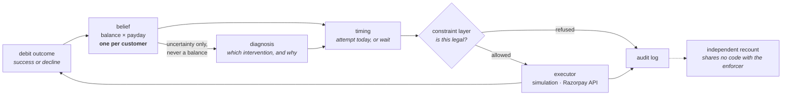

# UPI AutoPay Recovery Agent

An agent that schedules retries for failed subscription debits on UPI AutoPay.
It maintains a probability distribution over the customer's bank balance and
over the day their salary arrives, and attempts the debit when the balance is
likely to cover it.

## The problem

Indian subscription payments run on UPI AutoPay. A mandate authorises a merchant
to debit a customer once per billing cycle. If the account is short at the
moment of the charge, the debit is declined.

NPCI permits four attempts per mandate per cycle: one presentation and three
retries. Razorpay's documented schedule uses them on day T, T+1, T+2 and T+3,
then halts. That spends every attempt inside four days of the due date, which is
often before the customer is paid. A mandate that fails all four attempts dies
and forfeits its remaining billing cycles.

## Approach

Each decline is treated as a measurement. A failed ₹550 debit means the balance
was below ₹550 at that moment; a successful one means it was at least ₹550.

The agent maintains a distribution over the customer's balance and payday.
Each attempt outcome updates it. Once a day the timing policy compares the
probability of clearing today against the best probability available on any
remaining day of the cycle, and either attempts or waits. Proposed actions pass
through a constraint layer that enforces NPCI's mandate rules before execution.
Every decision is appended to an audit log, including the decision to wait.

## Results

| | agent | fixed schedule | source |
|---|---|---|---|
| Billing cycles collected | 94.36% | — | `agent.batch_report` |
| Recovered across the batch | ₹5,994,430 | — | `agent.batch_report` |
| Of debits that would fail on their due date, share recovered | 90.55% | 16.35% | `test_recovery_rates` |
| Mandates alive after 120 days | 97.2% | 32.1% | `test_recovery_rates` |

The first two rows are 100 customers × 5 mandates over 4 held-out populations.
The last two use the same design over 8 populations. Both run 120 days with
payday known to ±7 days, at `pop_spend=1.05`. The `payday_wait` baseline
collects 57.70% of cycles, 36.66 points below the agent (2 SE 2.47).

The fixed schedule's survival rate is low because it uses all four attempts
within four days of the due date and reaches the NPCI cap while the account is
still empty. The cycle-collection metric prices mandate death directly: a dead
mandate forfeits its remaining cycles, so no lifetime-value constant is needed.

All results are simulated. No Razorpay transaction, mandate or decline code has
been observed by this project.

[`docs/index.html`](docs/index.html) is an interactive walkthrough of one
customer's month, a rail outage, and the cases where the baseline wins. Static
page, no build step: `python -m http.server --directory docs`.

## External validation

No public benchmark exists for payment retry scheduling — no shared dataset,
held-out set or leaderboard. The available comparisons are aggregate statistics
published by companies selling recovery software. They are second-hand, they
aggregate customer bases that are not comparable, and one states in its
methodology note that its figures are ranges rather than laws.

The simulation is calibrated against a single anchor. The four figures below
were not used in calibration.

| | measured | published | |
|---|---|---|---|
| Share of debits failing on their due date | 13.68% | 8–15% | hit |
| Recovery under a fixed-interval retry schedule | 27.85% | 20–40% | hit |
| Recovery under smart retry timing | 97.38% | 70–85% | miss, too high |
| Share of recoveries landing inside 10 days | 41.84% | 85–95% | miss, too slow |

8 held-out populations at `pop_spend=0.80`, the calibration whose failure rate
falls inside the published band. Reproduce with
`python agent/tests/test_recovery_rates.py`. Sources are listed in
[`docs/01_FACTS.md`](docs/01_FACTS.md).

The two hits come from different parts of the model: the first is a property of
the simulated world, the second of a baseline policy running inside it.

The two misses have separate causes, both in the world model rather than the
agent:

- Recovery is too high because no simulated customer is permanently unable to
  pay. A clairvoyant scheduler collects 100% at every calibration tested.
  Adding customers who cannot pay brings recovery into the published band.
- Recovery is too slow because a mandate's due date and its customer's payday
  are drawn independently, so the gap between them averages half a cycle. Only
  35.8% of at-risk cycles have money available inside ten days, and the agent
  recovers 42.6% of them in that window. Real billing dates cluster near
  paydays; these do not.

Temporary account holds were expected to account for the second miss. Swept
across 14 alternative worlds, they moved it by under one point. No alternative
world in that sweep scores better against the published figures than the
calibration above.

### Sensitivity to world hardness

`pop_spend` sets how much of a salary a customer spends per cycle.

| `pop_spend` | baseline per-attempt approval | agent − baseline |
|---|---|---|
| 0.60 | 93.2% | +3.51 ±0.88 |
| 0.80 | 84.6% | +6.29 ±1.42 |
| 0.90 | 66.2% | +14.73 ±1.83 |
| 1.05 | 39.7% | +36.43 ±3.37 |

Due-date failure is 13.68% at `pop_spend=0.80` and 68.71% at 1.05.

At 0.80, where the failure rate matches the published band, the agent is worth
6.29 points. The published industry benchmark for retry optimisation is a 6–8%
uplift. No parameter was fitted against either figure. Reproduce with
`python scripts/spend_sweep.py`.

## Quickstart

```bash
pip install numpy==2.4.2
python -m agent.batch_report --pops 4
```

Roughly 50 seconds. No API key, no network, no model download.

The run covers four populations of 100 customers and prints the headline beside
the baseline, then the supporting detail. Stopping rules that fired:

```
STOPPING RULES THAT FIRED, grouped by rule
  agent, deterministic
     COLLECTED             6172
     CYCLE_CLOSED           675
     ESCALATED               45
     AGENT_STOP               4
     MANDATE_DEAD             3
```

Constraint refusals, counted twice — once by the gate that refuses, and once by
an auditor that rebuilds legality from the log and cannot import the gate:

```
                   arm        rule  gate refused  auditor found  agree?
  agent, deterministic         cap             0              0     yes
  agent, deterministic        peak             0              0     yes
  agent, deterministic        lead             0              0     yes
  agent, deterministic     pending             0              0     yes
  agent, deterministic   represent             0              0     yes
                             TOTAL             0              0     yes   over 8954 executed money actions
```

Querying the audit trail by `action_id` returns the full chain behind one
payment:

```
  action_id b9798daaff4e2c93   mandate c11m1
  WHAT THE BELIEF THOUGHT
     p(success) now 0.3114, best later 0.3081, index score +17.60  -> ok
  WHAT THE DIAGNOSER SAID, AND WHY
     root cause   INSUFFICIENT_FUNDS
     intervention RETRY  confidence 0.7
     source       fallback  prompt det-rules-v1
     rationale    Proceeding with the attempt our timing model scores highest…
     governance   ok=True
  ALL FIVE CONSTRAINT VERDICTS
     cap PASS   peak PASS   lead PASS   pending PASS   represent PASS
  THE MONEY ACTION
     Rs 630.00 at t=56 (day 2, hour 08), notified t=32, gate=ALLOWED
  THE OUTCOME
     OK  success=True  recovered Rs 630.00
```

That run writes 29,671 events to `agent/runs/batch_report_chain.jsonl`, one row
per event, append-only.

Two further offline commands:

```bash
python scripts/prove_stage0_refuses.py
```

Runs the constraint layer against the Razorpay client with a transport that
raises if it is ever called, showing that an illegal action is refused before
any request is made. It then injects an action below the gate, which the auditor
detects from the log.

```bash
python agent/eval/run_eval.py --llm --judge --replay
```

Replays the diagnosis eval from committed response caches. 0.5s, $0.00.

If `import numpy` fails, check the interpreter rather than the dependency list.
On Windows with msys2 on `PATH`, `python` can resolve to a build with neither
numpy nor pip. `sim/gate.py` and the git hooks probe for an interpreter that can
import numpy instead of trusting the name.

## How it works

Once a day, for each live mandate:

1. **Update the belief.** One distribution per customer covering the balance and
   which day of the 30-day cycle the salary lands. All of a customer's mandates
   share it, so an outcome on one subscription informs the timing of the others.
2. **Score today against later.** The belief gives the probability that a debit
   clears today and the best probability on any remaining day of the cycle. A
   negative index score means waiting has higher expected value.
3. **Diagnose the failure.** A language model assigns a root cause and selects an
   intervention: retry, nudge, escalate or stop. It falls back to a deterministic
   rule engine on any failure.
4. **Check the action against the mandate rules.** At most four attempts per
   mandate per cycle; no execution during peak hours; at least 24 hours between
   the pre-debit notification and the debit; one pending notification per
   mandate; no re-presentation of an insufficient-funds decline under the old
   notification.
5. **Execute or refuse.** Refused actions never reach an executor. The executor
   is an interface with two implementations: the simulation and Razorpay's API.
6. **Record the outcome** in the belief, success or decline.
7. **Log the decision**, including days when nothing was attempted.



Sharing one belief across a customer's mandates is worth 9.53 points at
`pop_spend=1.05` and 3.47 points at 0.80. Like the headline, it varies with
world hardness. This is the case for running the system at an aggregator rather
than at a single merchant.

Two boundaries are enforced in code, each with a test:

**The language model cannot choose when to debit.** It diagnoses why a payment
failed and selects among interventions. `Diagnosis` has no temporal field, so a
time cannot be expressed in its return type, and an import-graph test prevents
that layer from importing the belief, the timing code, the constraint layer or
the executor.

**The constraint layer refuses; a separate auditor recounts.** The gate counts
actions it stopped; the auditor counts illegal actions that occurred. The two
components share no code. `scripts/prove_stage0_refuses.py` moves money below
the gate and shows the auditor detecting it.

### Language model role

The model decides what to do and explains why. The belief filter decides when.
The constraint layer decides whether the action is permitted.

| | rule engine | `glm-5.3-flash` |
|---|---|---|
| terminal decline codes, where no retry can succeed | 0/4 | 4/4 |
| ambiguous cases | 9/21 | 10/21 |
| unambiguous cases | 19/19 | 13/19 |

The model performs best on terminal decline codes — a frozen account or a
revoked mandate — where the correct action is to stop and the timing score has
no way to represent the situation. It performs worse than the rule engine on
unambiguous cases. It therefore runs as an overlay: any failure falls back to
the rule engine, and each audit row records which component answered.

These scores are at `reasoning_effort=low`. At `high` and `max` the terminal
result stays at 4/4. The ambiguous result does not: at `high` the model scores
7/21 and the rule engine wins. A one-case margin on 21 cases is weak evidence.
Full sweep in [`docs/02_RESULTS.md`](docs/02_RESULTS.md).

The batch caps live network calls per run and serves cached responses free, so
the headline does not depend on an API key. The eval replays from committed
caches in 0.5 seconds for $0.00. The judge is a different model from the
diagnoser, and the harness refuses to run if the two SKU names match.

## Error handling

| Condition | Behaviour |
|---|---|
| The language model errors, times out, or returns unparseable output | Falls back to the deterministic rule engine and logs `LLM_FAILURE`. The batch takes this path about 95% of the time by design. |
| The model returns an instruction containing a time | Rejected by the governance check. `Diagnosis` has no field in which a time could be returned. |
| An action would breach a mandate rule | Refused before the executor is called, and the refusal is written to the audit trail. Refused actions generate no network traffic. |
| The payment rail is degraded across many customers | Detected from cross-customer outcomes; the belief update is suppressed, since a technical decline is a property of the rail rather than of one customer's balance. |
| A debit's outcome is unknown — a timeout or a deemed transaction | Recorded as `pending`, not as a failure. Treating an unknown as a failure would permit a retry, and a retry on an unknown outcome risks a double debit. |
| An HTTP request is retried after a socket failure | The idempotency key is derived from the `action_id` already written to the audit trail, so the same logical debit produces the same key across a process restart. |
| Razorpay rejects the request itself — bad credentials, malformed body | Raises `RazorpayError` naming the HTTP status and response. Request-level rejections are not recorded as customer declines, since no payment was created. |
| A worker process dies during a measurement | The measurement raises. A crashed run is a failed result, not a missing one. |
| A second run appends to an existing audit log | Refused when the log is opened. |

## Timing sensitivity

Results depend on how accurately payday can be estimated in advance.
`payday_wait`, the baseline throughout, estimates the payday, waits for it, and
then attempts once a day.

*n=100, 8 held-out populations (seeds 700–707), 120 days, paired 2 SE.
Reproduce with `python sim/headline.py`.*

| Payday known to | `payday_wait` | This agent | Difference |
|---|---|---|---|
| ±1 day | 99.24% | 95.73% | −3.51 ±0.36 |
| ±3 days | 94.65% | 95.82% | +1.17 ±1.35, not significant |
| ±5 days | 72.18% | 95.82% | +23.64 ±2.61 |
| ±7 days | 59.14% | 95.57% | +36.43 ±3.37 |
| ±10 days | 48.11% | 95.62% | +47.50 ±3.17 |
| ±14 days | 40.01% | 93.16% | +53.15 ±2.90 |

The baseline is better when payday is known within about three days. Beyond
that it degrades sharply while the agent holds between 93% and 96%, because the
agent recovers the payday from observed outcomes instead of relying on the
estimate it was given.

How accurately payday can be estimated in India is unknown; no measurement of it
was found. The agent therefore learns it online and reports its own uncertainty.

Two further results:

- The agent's action space is worth 1.371 points at 120 days, almost entirely by
  holding back a final attempt to avoid mandate death. It is 0.563 points at 60
  days and 1.790 at 180, so the value grows with the horizon.
- Outage detection works, but acting on it does not help. Pooling outcomes
  across merchants, the agent detects a degraded UPI rail with 0 false alarms in
  48 runs and a true-positive rate of 1.00 at n≥100. A single merchant sees 0.38
  attempts per 24-hour window against a floor of 8 and cannot evaluate the
  statistic. Pausing dispatch during a detected outage measured −0.529 points,
  so it is off by default.

Experimental design and bias analysis for all of the above:
[`docs/02_RESULTS.md`](docs/02_RESULTS.md).

## Decline states without a timing interpretation

Razorpay does not return NPCI decline codes. It normalises them into 110 error
reasons of its own, and mapping between the two surfaces two states that change
the correct action.

**`funds_blocked_by_mandate`** — the balance is present but another mandate has
claimed it. Retrying is wrong. A merchant seeing only its own debits cannot
distinguish this from an empty account.

**`deemed_transaction`** — the response was lost, so whether the debit went
through is unknown and the customer may already have been charged. Retrying
risks a double debit.

Neither state can be expressed as a timing decision: no combination of
"probability now" and "probability later" encodes *do not act, because the
question is unanswerable*. Both are routed by the diagnosis layer. Neither is
simulated yet; adding them to the world's decline mix at swept rates is queued
as W8 in [`docs/04_BUILD_PLAN.md`](docs/04_BUILD_PLAN.md).

## What is simulated

**Simulated.** Customer balances, salary dates and spending; debit outcomes;
outage scenarios; the merchant population; every percentage and rupee total in
this repository.

**From published sources.** NPCI's five mandate execution rules and decline code
list; Razorpay's error reasons, documented retry schedule, Payment Downtime API
shape and payment error surface. Every external claim carries a source tag in
[`docs/01_FACTS.md`](docs/01_FACTS.md).

**Unknown.** Real AutoPay decline frequencies. How accurately payday can be
predicted in India. Whether an aggregator may lawfully use one merchant's
outcomes to schedule another's debit for the same customer. Whether Razorpay
accepts the recurring-charge request body in
`agent/execution/razorpay_executor.py`: the client authenticates against the
test API and reads successfully, but charging requires an authorised mandate,
and the body has never been submitted with one.

## Limitations

- **No real transaction data.** There is no public dataset for payment retry
  scheduling. Every number here comes from simulation, validated against
  published aggregates rather than ground truth.
- **Decline frequencies are unpublished.** NPCI names the codes without ranking
  them, and no source gives AutoPay-specific rates. Every rate in this
  repository is swept rather than chosen, and reported as a curve. The largest
  single sensitivity: sweeping the limit-decline rate over 0.00 / 0.05 / 0.15
  costs 0.00 / −2.87 / −13.46 points.
- **The legal status of cross-merchant pooling is unresolved in Indian law.** No
  statute or RBI circular addresses it directly. The nearest instrument is the
  DPDP Act 2023, whose purpose-limitation and consent provisions were
  operationalised by the DPDP Rules notified on 14 November 2025, which points
  at consent-gating rather than prohibition. Pooling is therefore a per-customer
  permission, and the cost of withholding it is measured: running fully
  non-pooled costs 9.54 points at `pop_spend=1.05` and 3.47 at 0.80; pooling
  only for consenting customers costs 4.79 and 1.48 at half consent. Reproduce
  with `python agent/tests/test_pooling_consent.py`.
- **Two calibration gates fail on monotonicity.** The belief filter models no
  balance floor at zero and approximates hourly spend jitter with a fixed 3-tap
  kernel. Both are structural and no parameter fixes either. Calibration error
  is inside its bound (ECE 0.026); the ordering of the reliability curve is
  what fails.
- **Sample size is bounded by compute.** n=100 × 5 mandates × 8 populations, one
  run seed each.

## Repository map

| Path | Contents |
|---|---|
| [`docs/08_ARCHITECTURE.md`](docs/08_ARCHITECTURE.md) | Architecture document: layers, interfaces, the decision rule, and what the headline is conditional on |
| [`docs/06_MODEL_CARD.md`](docs/06_MODEL_CARD.md) | What ships, what it is worth, and what it has not been tested on |
| [`docs/02_RESULTS.md`](docs/02_RESULTS.md) | Every result with its experimental design and bias analysis |
| [`docs/04_BUILD_PLAN.md`](docs/04_BUILD_PLAN.md) | Planned work and the validation suite |
| [`docs/03_ERRORS.md`](docs/03_ERRORS.md) | Defects found during development, each with its mechanism and the regression test added for it |
| [`docs/01_FACTS.md`](docs/01_FACTS.md) | External facts with source and confidence tags |
| [`docs/07_AGENT_BRIEF.md`](docs/07_AGENT_BRIEF.md) | Interface between the agent and the simulation |
| [`NOTES.md`](NOTES.md) | Append-only decision log |
| `agent/` | Policy, constraints, context, execution, LLM layer, audit trail, eval |
| `sim/` | The simulated world, the belief filters and the 25-gate suite |
| `scripts/` | Page data, constraint-layer demonstration, Razorpay connectivity ladder, calibration sweep, git hooks |

## Running the tests

```bash
python sim/gate.py --tier fast
```

```bash
python sim/gate.py --tier full
```

The fast tier (~35s idle) checks that behaviour has not changed. The full tier
(~100s idle) adds the statistical gates. Both roughly double on a busy machine;
the suite saturates eight worker processes.

Individual agent gates:

```bash
python agent/tests/test_stage0_enforces.py      # constraint layer, 20 checks
python agent/tests/test_parity_vs_harness.py    # agent matches simulation bit-exactly
python agent/tests/test_recovery_metric.py      # recovery metric, 5 mutants
```

Install the git hooks once per clone with `scripts/install-hooks.sh`. `git
commit` then runs the fast tier and `git push` runs the full tier.

---

Built for Razorpay's AI Buildathon, Track 3.
