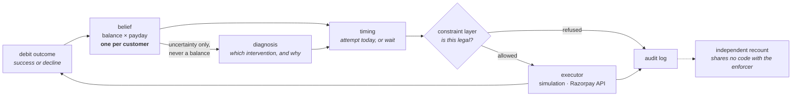

# UPI AutoPay Recovery Agent

**An agent that decides *when* to retry a failed subscription debit, by tracking
a probability distribution over the customer's bank balance and over the day
their salary arrives.**

Indian subscription payments run on UPI AutoPay: a mandate authorises a merchant
to debit a customer once per billing cycle, and when the account is short at
that exact moment the debit is declined. The standard response is a fixed retry
schedule — Razorpay documents charge on day T, then retry on T+1, T+2 and T+3,
then halt — which spends every permitted attempt inside a three-day window that
is often still before the customer is paid.

This project treats each decline as a measurement instead of only a loss. A
failed ₹550 debit says the balance was under ₹550 at that moment; a successful
one says it was at least ₹550. Those observations update a belief about the
balance and about which day of the cycle the salary lands, and the agent
schedules the next attempt for the day with the best remaining chance of
clearing. Every proposed money action passes a constraint layer that enforces
NPCI's mandate rules before execution, and every decision — including the
decision to wait — is appended to an audit log.

| | |
|---|---|
| **94.36%** | billing cycles collected |
| **57.70%** | collected by `payday_wait`, a simple payday-timing baseline |
| **+36.66 pts** | difference, 2 SE 2.47 |
| **₹5,994,430** | recovered across the batch |
| **0 / 0** | constraint refusals: the gate's own count, and an independent recount over 8,954 money actions |

*100 customers × 5 mandates over 4 held-out populations, 120 days, payday known
to ±7 days.*

> **Every result in this repository comes from a simulation.** No Razorpay
> transaction, mandate or decline code has been observed by this project.
> [What is simulated](#what-is-simulated) draws the line precisely.

**Interactive demo.** [`docs/index.html`](docs/index.html) walks through one
customer's month, the timing decision day by day, a rail outage, and the cases
where the simple baseline wins. It is a static page published from `docs/`; to
run it locally:

```bash
python -m http.server --directory docs
```

then open <http://localhost:8000>. Every figure it shows is pre-computed into
`docs/data/scenarios.json`; nothing is recalculated in the browser.

---

## Quickstart

```bash
pip install numpy==2.4.2
python -m agent.batch_report --pops 4
```

This runs the agent over four populations of 100 customers each and prints the
headline table with `payday_wait` beside it, the stopping rules that fired, the
constraint refusal counts with an independent recount, and the full decision
chain for one recovered payment.

- **~50 seconds** on a normal laptop.
- **No API key, no network, no model download.**
- Output goes to stdout; the audit trail is written to
  `agent/runs/batch_report_chain.jsonl`.

Two other things worth running, both offline:

```bash
# The constraint layer refusing an illegal debit against the real Razorpay
# client, with the network transport rigged to raise if it is ever reached.
python scripts/prove_stage0_refuses.py
```

```bash
# The diagnosis eval, replayed from committed response caches. 0.5s, $0.00.
python agent/eval/run_eval.py --llm --judge --replay
```

The language-model overlay (`python -m agent.batch_report --llm`) is the only
thing that needs credentials: a Z.ai key in `.env` at the repository root. It
runs the diagnosis layer through a model and prints the result beside the
deterministic arm. It is much slower, and it does not change the money —
94.33% against 94.36%.

> **If `import numpy` fails, the interpreter is wrong rather than the dependency
> list.** On Windows with msys2 on `PATH`, `python` can resolve to a build that
> has neither numpy nor pip. `sim/gate.py` and the git hooks probe for an
> interpreter that can import numpy instead of trusting the name; anything new
> should do the same.

## How it works

The agent runs once per day for every live mandate and works through seven
steps.

1. **Track the belief.** One probability distribution per *customer*, covering
   both the account balance and which day of the 30-day cycle the salary lands.
   All of a customer's mandates share it, so an outcome on one subscription
   informs the timing of the others.
2. **Score today against later.** The belief gives the probability that a debit
   of this amount clears today, and the best probability available on any
   remaining day of the cycle. An index score compares the two; a negative score
   means waiting is worth more, which it is on most days.
3. **Diagnose the failure.** A diagnosis layer names a root cause and picks an
   intervention: retry, nudge, escalate or stop. A language model does this,
   falling back to a deterministic rule engine on any failure.
4. **Check the action is legal.** Every proposed money action goes through the
   constraint layer, which enforces five NPCI rules: at most four attempts per
   mandate per cycle, no execution during peak hours, at least 24 hours between
   the pre-debit notification and the debit, one pending notification per
   mandate, and no re-presentation of an insufficient-funds decline under the
   old notification.
5. **Execute or refuse.** Allowed actions reach an executor; refused ones never
   do. The executor is an interface with two implementations: the simulated
   world, and Razorpay's live API.
6. **Fold the outcome back in.** Success or decline, the result updates the
   belief about both the balance and the payday.
7. **Log everything.** Every event is appended to a JSONL trail, including the
   days on which the agent decided to do nothing.



Two boundaries are enforced in code, and each has a test behind it.

**The language model never chooses when to debit.** It diagnoses why a payment
failed, picks among interventions, and writes the justification that goes into
the audit trail. Timing belongs to the belief filter, and the type the model
returns has no field in which a time could be expressed. Import rules, checked
by a test, keep the model layer from reaching the belief, the timing code, the
constraint layer or the world.

**The constraint layer refuses, and a separate auditor recounts.** The gate
rejects illegal actions before they reach an executor. A second component
rebuilds legality from the audit log alone, using code that is forbidden from
importing the enforcer, and the two counts are printed side by side. They
measure different things — the gate counts what it stopped, the auditor counts
what illegally happened. `scripts/prove_stage0_refuses.py` shows the difference
by moving money below the gate and watching the auditor catch it.

## Results

The headline number depends almost entirely on one parameter: how accurately
the customer's payday can be estimated in advance.

`payday_wait` is the baseline throughout. It estimates the customer's payday,
waits until that date, and then makes one attempt per day. It is a few lines of
code and a strong comparator when the estimate is good.

*n=100, 8 held-out populations (seeds 700–707), 120 days, paired 2 SE. Not
gate-protected; reproduce with `python sim/headline.py`.*

| Payday known to | `payday_wait` | This agent | Difference |
|---|---|---|---|
| ±1 day | **99.24%** | 95.73% | −3.51 ±0.36 — baseline wins |
| ±3 days | 94.65% | **95.82%** | +1.17 ±1.35 — not significant |
| ±5 days | 72.18% | **95.82%** | +23.64 ±2.61 |
| ±7 days | 59.14% | **95.57%** | +36.43 ±3.37 |
| ±10 days | 48.11% | **95.62%** | +47.50 ±3.17 |
| ±14 days | 40.01% | **93.16%** | +53.15 ±2.90 |

The crossover sits between ±3 and ±5 days. Below it the baseline is the better
choice. Above it the baseline degrades sharply while the learned policy holds
between 93% and 96% across the whole range, because it recovers the payday from
observed outcomes rather than relying on the estimate it was handed.

**How accurately payday can actually be estimated in India is not known.** No
measurement of it was found. The design response was to make the agent learn
payday online and expose its own uncertainty, rather than assume a value.

**The metric** is billing cycles collected ÷ cycles due over the full horizon. A
mandate that dies forfeits its remaining cycles, so the metric prices mandate
death directly instead of using an assumed customer lifetime value.

Three further measured results:

- **Sharing one belief across a customer's mandates is worth +9.53 points**
  (±1.81); the same comparison on the shipping configuration measures +9.61
  (±1.67). One merchant sees a customer's single monthly debit; an aggregator
  sees all five. That is the main argument for running this at the aggregator
  layer, and its legal basis is unresolved — see
  [Limitations](#limitations).
- **The agent's own action space is worth +1.371 points** at a 120-day horizon,
  entirely by preventing mandate death through holding back a final attempt. It
  is +0.563 at 60 days and +1.790 at 180 days, so it is a curve over the horizon
  rather than a constant.
- **Outage detection is a capability claim, not a recovery number.** Pooling
  every merchant's outcomes, the agent detects a degraded UPI rail with a
  false-alarm rate of 0 of 48 runs and a true-positive rate of 1.00 at n≥100 and
  severity 0.40. A single merchant sees 0.38 attempts per 24-hour window against
  a floor of 8 and cannot evaluate the statistic at all. Acting on the detection
  is a different question: pausing dispatch measured **−0.529 points (SIG)** at
  moderate severity, so it does not ship as default behaviour.

Full experimental design, bias analysis and every number:
[`docs/02_RESULTS.md`](docs/02_RESULTS.md).

## Two decline states from Razorpay's error list

The decline taxonomy in this project was built from NPCI's published error code
list. Razorpay does not return those codes — it normalises them into 110 error
reasons of its own, published as a spreadsheet. Mapping one onto the other
surfaced two states the NPCI-derived taxonomy had no name for, and both change
what the correct action is.

**`funds_blocked_by_mandate`** — the money is in the account, and another
mandate has already claimed it. The balance is adequate and no limit was
breached, so retrying into it is the wrong action. A merchant who can see only
their own debits cannot tell it apart from an empty account.

**`deemed_transaction`** — the response was lost, so whether the debit went
through is unknown and the customer may already have been charged. Retrying
risks a double debit, which is a worse outcome than not collecting. A timing
score cannot express this: there is no combination of "probability now" and
"probability later" that means *do not act, because the question is
unanswerable*.

Both are wired into the taxonomy and routed by the diagnosis layer. **Neither is
simulated and neither carries a frequency** — the simulated world models neither
state, and no source gives a rate for either.

Source: Razorpay's published `payments_error_reasons` list, 110 distinct
reasons, committed verbatim as `agent/execution/razorpay_reasons.txt`. Details:
[`docs/03_ERRORS.md`](docs/03_ERRORS.md) and
[`docs/01_FACTS.md`](docs/01_FACTS.md).

## What is simulated

**Simulated.** Customer balances, salary dates and spending; debit outcomes;
outage scenarios; the merchant population; and every percentage, rupee total and
comparison in this repository.

**Taken from external sources.** NPCI's five mandate execution rules and its
decline code list. Razorpay's published error reasons, documented retry
schedule, Payment Downtime API shape and payment error surface — all read from
public documentation on 29 August 2026. Every external claim carries a source
tag in [`docs/01_FACTS.md`](docs/01_FACTS.md); anything not in that file is not
established.

**Not known.** Real AutoPay decline frequencies, for any decline family. How
accurately payday can be predicted in India. Whether an aggregator may lawfully
use one merchant's outcomes to schedule another merchant's debit for the same
customer. Whether Razorpay's API accepts the request bodies in
`agent/execution/razorpay_executor.py`, which are derived from documentation and
have never been sent.

## Limitations

- **No real data, at any point.** The simulation's only anchor to reality is
  that it is tuned so the documented retry schedule reproduces roughly 30%
  per-attempt approval. Every absolute percentage inherits that calibration.
- **Simulation results are not production estimates.** The published industry
  benchmark for retry optimisation is a 6–8% uplift; a simulated +36.66 points
  is a statement about this world, not a forecast.
- **Two of the five constraint rules have no working test in the simulation** —
  the attempt cap and the pending-notification rule. Both are enforced and
  tested inside `agent/`, and those are the only working tests either rule has.
  Peak hours, notification lead and re-presentation are tested in both places.
- **The headline batch runs with the decline taxonomy switched off** — no frozen
  accounts, revoked mandates or limit hits. Switching it on costs between 0 and
  13.5 points, and every rate in that sweep is a guess.
- **The largest single sensitivity is a guessed constant.** How often a debit is
  refused by a transaction or mandate limit is not published anywhere; sweeping
  it over 0.00 / 0.05 / 0.15 costs 0.00 / −2.87 / −13.46 points. The curve is
  steeply non-linear, so interpolating the middle is not safe.
- **The timing score contains a hand-chosen discount** of 0.92 applied to the
  probability of a later day. Sweeping it from 0.80 to 1.00 moves the headline
  across a ~7 point band, with a plateau from 0.90 to 0.96.
- **The legal status of cross-merchant pooling is unresolved.** It underpins the
  strongest claim in this repository, and neither Razorpay's merchant terms nor
  the relevant RBI directions have been read.
- **Six of twenty-five simulation gates are red on a clean checkout**, on
  purpose. `sim/known_failures.txt` gives a written reason for each.
- **The study is small.** n=100, 8 populations, one run seed each.
- **The language model is mostly bypassed in the batch.** The loop asks for a
  diagnosis 119,667 times over four populations and runs under a hard cap on
  network calls, giving a 94.8% fallback rate. The batch's LLM arm is therefore
  95% deterministic and is not "the model's number".

## Repository map

| Path | What is there |
|---|---|
| [`docs/06_MODEL_CARD.md`](docs/06_MODEL_CARD.md) | What ships, what it is worth, and eleven things it was never tested on. Read before quoting a number. |
| [`docs/02_RESULTS.md`](docs/02_RESULTS.md) | Every result, with its experimental design and bias analysis |
| [`docs/03_ERRORS.md`](docs/03_ERRORS.md) | Twenty-six errors found in this project's own work, each with its mechanism and the guard added for it |
| [`docs/01_FACTS.md`](docs/01_FACTS.md) | Every external fact, with a source and a confidence tag |
| [`docs/07_AGENT_BRIEF.md`](docs/07_AGENT_BRIEF.md) | The interface between the agent and the frozen simulation |
| [`docs/05_TEST_DESIGN.md`](docs/05_TEST_DESIGN.md) | The test philosophy, written before the test harness |
| [`docs/00_HANDOFF.md`](docs/00_HANDOFF.md) | Project state, decisions taken, and what is still open |
| [`NOTES.md`](NOTES.md) | The decision log, append-only and unedited |
| `agent/` | The agent: policy, constraints, context, execution, LLM layer, audit trail, eval |
| `sim/` | The simulated world, the belief filters and the 25-gate test suite. Frozen. |
| `scripts/` | Page data generation, the constraint-layer demonstration, git hooks |
| `legacy/` | An earlier, known-defective simulation. Kept as a regression reference. |

## Running the tests

```bash
python sim/gate.py --tier fast
```

```bash
python sim/gate.py --tier full
```

The fast tier (~35s idle) checks that the code still behaves the same way; the
full tier (~100s idle) adds the statistical gates. The suite saturates eight
worker processes, so anything else running roughly doubles both figures. Six
gates are expected to fail on a clean checkout, each with a written reason in
`sim/known_failures.txt`. A gate reported as `VACUOUS` — one that no deliberate
mutation can trip — is treated exactly like a failure, because a test nothing
can break is not evidence.

The agent's own gates live in `agent/tests/` and are run individually, for
example:

```bash
python agent/tests/test_stage0_enforces.py      # the constraint layer, 20/20
python agent/tests/test_parity_vs_harness.py    # agent == simulation, bit-exact
python agent/tests/test_razorpay_mapping.py     # the Razorpay backend, 44/44
```

Install the git hooks once per clone with `scripts/install-hooks.sh`; `git
commit` then runs the fast tier and `git push` runs the full tier.

---

Built for Razorpay's AI Buildathon, Track 3.
