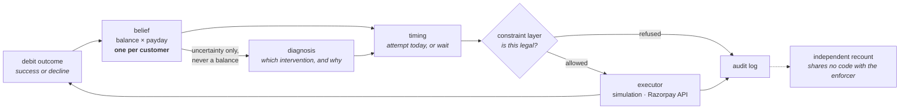

# UPI AutoPay Recovery Agent

An agent that schedules retries for failed subscription debits on UPI AutoPay.
It maintains a probability distribution over the customer's bank balance and
over the day their salary arrives, and attempts the debit when the balance is
likely to cover it.

## The problem

Indian subscription payments run on UPI AutoPay. A mandate authorises a merchant
to debit a customer once per billing cycle. If the account is short at the
moment of the charge, the debit is declined.

NPCI permits four attempts per mandate per cycle: one presentation and three
retries. Razorpay's documented schedule uses them on day T, T+1, T+2 and T+3,
then halts. That spends every attempt inside four days of the due date, which is
often before the customer is paid. A mandate that fails all four attempts dies
and forfeits its remaining billing cycles.

## Approach

Each decline is treated as a measurement. A failed ₹550 debit means the balance
was below ₹550 at that moment; a successful one means it was at least ₹550.

The agent maintains a distribution over the customer's balance and payday.
Each attempt outcome updates it. Once a day the timing policy compares the
probability of clearing today against the best probability available on any
remaining day of the cycle, and either attempts or waits. Proposed actions pass
through a constraint layer that enforces NPCI's mandate rules before execution.
Every decision is appended to an audit log, including the decision to wait.

## Results

Two different quantities are reported below, in two tables, because they have
different denominators. **Cycle collection** counts every billing cycle due,
including the ones that never failed. **Recovery** counts only the debits that
would have failed on their due date. Published industry figures are recovery
rates. This project's own metric is cycle collection, because it prices mandate
death: a dead mandate forfeits its remaining cycles.

Both tables run the same world: 100 customers, mandates per customer drawn from
`1 + Poisson(1)` capped at 8, 120 days, `payday_err=7`, `pop_spend=0.93`, and 12
burn-in cycles discarded before measurement.

**Cycles collected.** *Full agent mode, 10 held-out populations (seeds
710–719), run seed 7.* `py -3.12 -m agent.batch_report --pops 10 --canonical`,
*transcript* `logs/w24_headline_repaired.txt`.

| | agent | `payday_wait` |
|---|---|---|
| Billing cycles collected | 99.38% | 90.29% |
| Recovered across the batch | ₹7,511,500 | — |

**+9.08 points, 2 SE 1.84.** Transcript: `logs/w24_headline_repaired.txt`.

**Recovery of debits that would fail on their due date.** *Degenerate mode, 20
populations (seeds 700–719), run seed 907.*
`py -3.12 agent/tests/test_canonical_world.py --confirm`, *transcript*
`logs/w24_canonical_repaired.txt`.

| | agent | fixed schedule |
|---|---|---|
| Share of at-risk debits recovered | 95.24% | 20.41% |
| Mandates alive after 120 days | 99.4% | 85.3% |

`pop_spend` is the share of a salary a customer spends per cycle. It is set to
one minus India's household saving rate, which three published RBI readings put
between 7% and 20%, so `pop_spend` is a range of 0.80 to 0.93 rather than a
single value. 0.93 is the top of that range and the only part of it where
enough debits fail to measure a recovery difference at all — see
[Sensitivity to world hardness](#sensitivity-to-world-hardness).

The fixed schedule's survival rate is lower because it uses all four attempts
within four days of the due date and reaches the NPCI cap while the account is
still empty.

All results are simulated. No Razorpay transaction, mandate or decline code has
been observed by this project.

[`docs/index.html`](docs/index.html) is an interactive walkthrough of one
customer's month, a rail outage, and the cases where the baseline keeps up.
Static page, no build step: `python -m http.server --directory docs`.

## External validation

No public benchmark exists for payment retry scheduling — no shared dataset,
held-out set or leaderboard. The available comparisons are aggregate statistics
published by companies selling recovery software. They are second-hand, they
aggregate customer bases that are not comparable, and one states in its
methodology note that its figures are ranges rather than laws.

The simulation is calibrated against a single anchor. The four figures below
were not used in calibration.

| | measured | published | |
|---|---|---|---|
| Share of debits failing on their due date | 10.50% | 8–15% | hit |
| Recovery under a fixed-interval retry schedule | 22.15% | 20–40% | hit |
| Recovery under smart retry timing | 95.24% | 70–85% | miss, too high |
| Share of recoveries landing inside 10 days | 42.97% | 85–95% | miss, too slow |

100 customers per population at `pop_spend=0.93`, the end of the range where
the failure rate falls inside the published band. Sources are listed in
[`docs/01_FACTS.md`](docs/01_FACTS.md).

**The four rows do not share a sample size.** Rows one and two are properties of
the world and of a policy this project did not write, so they are measured on
100 populations: `py -3.12 agent/tests/test_v3_power.py`, transcript
`logs/w24_v3_power.txt`. Rows three and four measure the agent and are measured
on 20: `py -3.12 agent/tests/test_canonical_world.py --confirm`, transcript
`logs/w24_canonical_repaired.txt`.

**Why the third row is above its band.** The second and third rows are measured
in the same world, at the same calibration, with the same run seed. The second
runs a policy this project did not design — Razorpay's documented
fixed-interval schedule, made legal — and it lands inside its published band at
22.15%, with a 2 SE of 1.95 over 100 populations. A world calibrated to be easy
would lift both rows. The second is in band and the third is above it, so the
excess belongs to the agent rather than to the world.

**What would falsify it.** The second row dropping below 20% at a larger
sample, which would mean the world is harder than the published baseline range
and the third row's excess is not the agent. Or the second row sitting in band
only at a calibration where the first leaves its own band, which would be two
dials fitted to two targets rather than a world that matches on both.

**What it is not.** Both bands are `[REPORTED]`, vendor-sourced, and aggregate
customer bases that are not comparable to each other or to this world. The
70–85% band is the source's top performers; its stated median is 47.6%. The
world and the agent share an author. This is an internal consistency argument,
not independent evidence.

The two hits come from different parts of the model: the first is a property of
the simulated world, the second of a baseline policy running inside it.

The two misses have separate causes:

- Recovery is too high because no simulated customer is permanently unable to
  pay. A clairvoyant schedule that obeys the four-attempt cap, the 24-hour
  notice rule and legal presentation hours still collects 100% of at-risk
  cycles at every calibration tested. The third row therefore measures the
  agent's behaviour rather than the world's difficulty.
- Recovery is too slow because a mandate's due date and its customer's payday
  are drawn independently, so the gap between them averages half a cycle. The
  same clairvoyant schedule reaches only 51.5% of at-risk cycles inside ten
  days, which is below the published band's floor. The agent reaches 42.97%,
  or 83.4% of what is available. The published band is drawn from card
  dunning, where a customer can fix the instrument on demand; UPI AutoPay
  recovery waits for a roughly monthly salary credit.

Temporary account holds were expected to account for the second miss. Swept
across 14 alternative worlds, they moved it by under one point.
`logs/w7_rerun.txt`, with `logs/w2_rerun.txt` for the insolvency arm.
⚠️ **Both predate the 1 September belief repair** and are quoted here for
direction only, never for their levels — see the staleness register in
[`docs/02_RESULTS.md`](docs/02_RESULTS.md). Neither has been re-run.

Income paid in several instalments a month is the only mechanism found that
lifts the ten-day ceiling. Swept over irregular-income fractions of 0.20 to
0.60 and 4 to 12 credits a month, the ceiling reaches 87.57% at the top corner
and stays at 71.8–81.2% in the middle (`logs/w12_irregular_ceiling.txt`; this
one is a property of the world, measured policy-free, so the belief repair
cannot move it). It is left off. No source gives a payment-frequency mix for UPI AutoPay holders specifically, and at the agent's
measured capture ratio of 83.4% even the top corner puts the fourth row at
about 73%, still below its band.

### Sensitivity to world hardness

`pop_spend` sets how much of a salary a customer spends per cycle. It is one
minus the household saving rate. India's published FY25 rate has three readings
— about 18–20% including physical assets, 11.8% gross financial, 7% net
financial — which puts `pop_spend` between 0.80 and 0.93. No single value inside
that range is declared.

| `pop_spend` | `payday_wait` | agent | agent − baseline | at-risk cycles |
|---|---|---|---|---|
| 0.80 | 99.07% | 100.00% | +0.93 ±0.60 | 2 |
| 0.85 | 97.36% | 99.83% | +2.47 ±0.93 | 83 |
| 0.88 | 95.99% | 99.65% | +3.66 ±0.86 | 197 |
| 0.90 | 94.24% | 99.53% | +5.29 ±0.82 | 299 |
| 0.93 | 90.29% | 99.38% | +9.08 ±1.84 | 557 |

Cycles collected, 10 held-out populations of 100 customers, 120 days,
`payday_err=7`, run seed 7. Transcript `logs/w24_conditional_repaired.txt`.
Due-date failure is 3.49% at `pop_spend=0.88` and 10.58% at 0.93
(`logs/w24_canonical_repaired.txt`).

The last column is the number of billing cycles a debit on the due date would
not have covered. Both arms collect every cycle that was never at risk, so the
difference between them is carried entirely by that column. At `pop_spend=0.80`
there are two such cycles across a thousand customers, and the +0.93 in that
row is not a measurement of anything.

At 0.93 the agent is worth 9.08 points. The published industry benchmark for
retry optimisation is a 6–8% uplift. No parameter was fitted against either
figure. Reproduce with `py -3.12 -m agent.batch_report --pops 10 --canonical`
for the 0.93 row; the other rows change `pop_spend` and are not
gate-protected.

## Quickstart

Verified Windows commands:

```powershell
py -3.12 -m pip install numpy==2.4.2
py -3.12 -m agent.batch_report --pops 10 --canonical
```

On macOS or Linux, use a Python 3.12 interpreter with NumPy 2.4.2 and replace
`py -3.12` with that interpreter's command.

Roughly 30 seconds. No API key, no network, no model download.

The run covers ten populations of 100 customers and prints the headline beside
the baseline, then the supporting detail:

```
THE BATCH -- 100 customers x ~2 mandates (1 + Poisson(1), capped at 8) over 10 held-out populations, 120 days, payday_err=+/-7, pop_spend=0.93

                   arm  cycles collected    Rs recovered  survival  att/cycle    2 SE
   payday_wait (rival)            90.29%              --    90.52%      1.272
  agent, deterministic            99.38%    Rs 7,511,500    99.84%      1.446   1.844

  agent, deterministic vs payday_wait: +9.08 pts (2 SE 1.84, SIG)
```

Stopping rules that fired:

```
STOPPING RULES THAT FIRED, grouped by rule
  agent, deterministic
     COLLECTED             7548
     CYCLE_CLOSED           307
     LAST_ATTEMPT_HELD       28
     MANDATE_DEAD             3
```

The gate counts actions it refused. An auditor that cannot import the gate
counts illegal actions that nevertheless executed. These are different
quantities; a clean run has zero in both columns for different reasons:

```
                   arm        rule  gate refused  illegal executed
  agent, deterministic         cap             0                 0
  agent, deterministic        peak             0                 0
  agent, deterministic        lead             0                 0
  agent, deterministic     pending             0                 0
  agent, deterministic   represent             0                 0
                             TOTAL             0                 0   over 8702 executed money actions
```

Querying the audit trail by `action_id` returns the full chain behind one
payment. The report chooses the first fully logged success, so its generated
action ID is run-specific. One example chain is:

```
  mandate c18m1
  WHAT THE BELIEF THOUGHT
     p(success) now 0.5753, best later 0.6150, index score +11.83  -> ok
  WHAT THE DIAGNOSER SAID, AND WHY
     root cause   INSUFFICIENT_FUNDS
     intervention RETRY  confidence 0.7
     source       fallback  prompt det-rules-v2
     rationale    Proceeding with the attempt our timing model scores highest…
     governance   ok=True
  ALL FIVE CONSTRAINT VERDICTS
     cap PASS   peak PASS   lead PASS   pending PASS   represent PASS
  THE MONEY ACTION
     Rs 1,250.00 at t=152 (day 6, hour 08), notified t=128, gate=ALLOWED
  THE OUTCOME
     OK  success=True  recovered Rs 1,250.00
```

That run writes 30,538 events to `agent/runs/batch_report_chain.jsonl`, one row
per event, append-only (`logs/w24_headline_repaired.txt`; the pre-repair batch
wrote 31,225).

Two further offline commands:

```bash
py -3.12 scripts/prove_stage0_refuses.py
```

Runs the constraint layer against the Razorpay client with a transport that
raises if it is ever called, showing that an illegal action is refused before
any request is made. It then injects an action below the gate, which the auditor
detects from the log. No key, no network, no simulation. Transcript
`logs/w28_stage0_refuses.txt`.

```bash
py -3.12 scripts/prove_workflows.py
```

Writes a funding reminder (no Payment Link), creates one last-attempt Payment
Link, GETs it, cancels it, and appends a merchant-queue row. Refuses to run
if the key is not `rzp_test_`. Does not charge a mandate. Set
`RECOVERY_NOTIFY_EMAIL` to have Razorpay email the backup link.

```bash
py -3.12 scripts/prove_smtp_reminder.py
```

Sends one funding-reminder email through the executor's generic SMTP path
(`SMTP_HOST`, `SMTP_PORT`, `SMTP_USER`, `SMTP_PASSWORD`, `SMTP_FROM`,
`RECOVERY_NOTIFY_EMAIL`). Does not call Razorpay or create a Payment Link.
Writes `logs/smtp_reminder_proof.json`.

```bash
py -3.12 agent/eval/run_eval.py --llm --judge --replay
```

Replays the diagnosis eval from committed response caches. 0.5s, $0.00.

If `import numpy` fails, check the interpreter rather than the dependency list.
On this Windows machine, `python` resolves to Python 3.14 without NumPy;
`py -3.12` resolves to the verified Python 3.12 environment with NumPy 2.4.2.
`sim/gate.py` and the git hooks probe for an interpreter that can import NumPy
instead of trusting the executable name.

## How it works

Once a day, for each live mandate:

1. **Update the belief.** One distribution per customer covering the balance and
   which day of the 30-day cycle the salary lands. All of a customer's mandates
   share it, so an outcome on one subscription informs the timing of the others.
2. **Score today against later.** The belief gives the probability that a debit
   clears today and the best probability on any remaining day of the cycle. A
   negative index score means waiting has higher expected value.
3. **Diagnose the failure.** A language model assigns a root cause and selects an
   intervention: retry, nudge, escalate or stop. It falls back to a deterministic
   rule engine on any failure. For a reminder, a last-attempt checkout, and an
   escalate it also writes the customer or merchant copy.
4. **Check the action against the mandate rules.** At most four attempts per
   mandate per cycle; no execution during peak hours; at least 24 hours between
   the pre-debit notification and the debit; one pending notification per
   mandate; no re-presentation of an insufficient-funds decline under the old
   notification.
5. **Execute or refuse.** Refused actions never reach an executor. The executor
   is an interface with two implementations: the simulation and Razorpay's API.
   A retry is a debit. After the first or second insufficient-funds decline, a
   reminder is written (and emailed if SMTP is configured). After the third,
   a Payment Link replaces the fourth mandate debit: that debit is not fired
   while the link is open, and is not fired if the link expires or is
   cancelled unpaid, so the mandate survives into the next cycle. Escalate
   appends a merchant-queue file. It stops further debits only when the
   mandate itself is broken, the account is frozen, or funds are already
   claimed by another mandate.
6. **Record the outcome** in the belief, success or decline.
7. **Log the decision**, including days when nothing was attempted.



Sharing one belief across a customer's mandates is worth **7.32 points**
(gate S2a_PD, shipping filter, ±2.02) at `pop_spend=1.05` and **1.30 points**
(±0.42) at 0.80 (agent measurement, not gate-protected). Both figures come from
the gate suite's world, which runs 5 mandates per customer, and that is not the
world the results above are measured on. Like the headline, the figure varies
with world hardness — and it varies by more than a factor of five across the
two calibrations, so the hard-world number on its own overstates it. This is
the case for running the system at an aggregator rather than at a single
merchant, and it is a weaker case at the gentler calibration than at the harder
one. Both were re-measured on 1 September 2026 after the payday prior was
re-selected; `logs/w26_gate_full_moat_remeasure.txt` and
`logs/w26_w9_pooling_consent_remeasure.txt`.

Two boundaries are enforced in code, each with a test:

**The language model cannot choose when to debit.** It diagnoses why a payment
failed and selects among interventions. `Diagnosis` has no temporal field, so a
time cannot be expressed in its return type, and an import-graph test prevents
that layer from importing the belief, the timing code, the constraint layer or
the executor.

**The constraint layer refuses; a separate auditor recounts.** The gate counts
actions it stopped; the auditor counts illegal actions that occurred. The two
components share no code. `scripts/prove_stage0_refuses.py` moves money below
the gate and shows the auditor detecting it.

### Language model role

Every debit, stop, and escalate decision is deterministic. The model is invoked
only when `merchant_note` is non-empty — unstructured merchant input the rules
cannot read — and to write exception-facing copy (escalate briefs, audit
narrative). Reminder and backup-link text use templates.

| | rule engine | routed LLM (`merchant_note` only) |
|---|---|---|
| `merchant_note` cases (4 registered) | 4/4 | 2/4 |
| injection cases (3) | structural pass | structural pass |

The full 40-case table remains in the eval harness for history; it is not the
shipping path. Prompt `glm-diag-v3`, `reasoning_effort=low`. Measured 31 August
2026: `py -3.12 agent/eval/run_eval.py --llm --judge` ($0.08). Replay:
`py -3.12 agent/eval/run_eval.py --llm --judge --replay`, from the committed
response cache, 0.5s and $0.00; transcript `logs/w28_llm_eval_replay.txt`.
Pre-registration 8/8 on that replay. This family reads no belief on any path
that affects its claim, so the 1 September repair does not reach it.

The money headline (`batch_report`) is filter plus rules only. `--demo-llm`
prints routing stats on one population; sim populations have no `merchant_note`
by default.

## Error handling

| Condition | Behaviour |
|---|---|
| The language model errors, times out, or returns unparseable output | Falls back to the rule engine on routed `merchant_note` ticks and logs `LLM_FAILURE`. |
| The model returns an instruction containing a time | Rejected by the governance check. `Diagnosis` has no field in which a time could be returned. |
| An action would breach a mandate rule | Refused before the executor is called, and the refusal is written to the audit trail. Refused actions generate no network traffic. |
| The payment rail is degraded across many customers | Detected from cross-customer outcomes; the belief update is suppressed, since a technical decline is a property of the rail rather than of one customer's balance. |
| A debit's outcome is unknown — a timeout or a deemed transaction | Recorded as pending. The rule engine stops further debits on that cycle. Retrying an unknown outcome is refused. |
| Reminder (after the 1st or 2nd insufficient-funds decline) | Writes the customer-facing copy to an outbox JSONL audit row, then sends email through the executor's generic SMTP path when `SMTP_HOST` and `RECOVERY_NOTIFY_EMAIL` are set. `executed=True` only after the SMTP server accepts the message. Does not create a Payment Link and does not skip the remaining mandate attempts. |
| Last-attempt backup checkout | After a 3rd insufficient-funds decline, creates a Razorpay Payment Link. Email notify is on when `RECOVERY_NOTIFY_EMAIL` is set; SMS is off. The fourth mandate debit is not fired while the link is issued, paid, expired or cancelled. A paid link collects this cycle; an unpaid close holds the last attempt so the mandate is not killed. |
| Escalate | Appends `agent/runs/merchant_queue.jsonl`. Stops retries only for a broken mandate, a frozen account, or a lien. |
| An HTTP request is retried after a socket failure | The idempotency key is derived from the `action_id` already written to the audit trail, so the same logical debit produces the same key across a process restart. |
| Razorpay rejects the request itself — bad credentials, malformed body | Raises `RazorpayError` naming the HTTP status and response. Request-level rejections are not recorded as customer declines, since no payment was created. |
| A worker process dies during a measurement | The measurement raises. A crashed run is a failed result, not a missing one. |
| A second run appends to an existing audit log | Refused when the log is opened. |

## Timing sensitivity

Results depend on how accurately payday can be estimated in advance. Three
fixed schedules are measured against the agent. `naive` is Razorpay's
documented schedule made legal (T+1 to T+4). `payday_wait` estimates the
payday, waits for it, and then attempts once a day. `[1,7]` places two
attempts at fixed offsets from the same noisy payday estimate the agent is
given; the offsets were chosen once on training populations and then frozen.

*Recovery of at-risk cycles. n=100, 10 held-out populations (seeds 710–719),
120 days, `pop_spend=0.93`, paired 2 SE. `payday_wait` runs through the
harness, which computes no at-risk denominator, so it appears in the cycle
column only. Reproduce with
`py -3.12 agent/tests/test_steelman_schedule.py`; transcript
`logs/w25_steelman_final.txt`.*

| Payday known to | `naive` | `[1,7]` | This agent | agent − `[1,7]` |
|---|---|---|---|---|
| ±1 day | 23.00% | 99.75% | 98.59% | −1.16 |
| ±3 days | 23.00% | 98.51% | 98.18% | −0.33 |
| ±5 days | 23.00% | 96.63% | 97.78% | +1.15 |
| ±7 days | 23.00% | 90.88% | 94.43% | +3.55 |
| ±10 days | 23.00% | 66.93% | 90.76% | +23.83 |
| ±14 days | 23.00% | 55.47% | 89.88% | +34.41 |

The two are level when payday is known to within three days — −1.16 and −0.33
are both inside the measurement error — and the agent is ahead from ±5 upward.
The agent is nearly flat across the range (98.59% to 89.88%) because it recovers
the payday from observed outcomes; `[1,7]` collapses (99.75% to 55.47%) because
it cannot. `naive` is unaffected by the estimate because it never uses one.

Where the two are level, `[1,7]` is the cheaper policy: it collects the same
share on about a quarter fewer attempts per cycle (1.10 against 1.44) and
recovers faster (49.9% of at-risk cycles inside ten days at ±1 day, against
46.6%; `logs/w24_heldout_confirmation.txt`). The agent's value at that end of
the range is not higher collection. It is that its collection does not depend
on the payday estimate being good.

How accurately payday can be estimated in India is unmeasured. The Code on
Wages requires payment by the 7th or 10th of the month, most firms pay on the
last working day, and government salaries land on a fixed date — which points
at the low end of this table, where the frozen schedule wins.

A large margin over `naive` is not evidence for the belief filter. At ±1 day
the agent is 75.58 points ahead of `naive` and `[1,7]` is 76.75 points ahead.
Two fixed offsets take more of that margin than the agent does at ±1 and ±3;
from ±5 upward the agent takes more. `logs/w25_steelman_final.txt`.

Two further results:

- The agent's action space is worth 0.136 points at 120 days and that is
  **inside its own error bar** (2 SE 0.205), so it is reported as no measured
  effect rather than as a small win. Adding the funding nudge at its higher
  rates does clear the bar: +0.353 (2 SE 0.205) at `p=0.25` and +0.387 (2 SE
  0.217) at `p=0.50`. `ESCALATE` and `STOP` never fire and are worth 0.000
  each. Re-measured on the shipped belief; `logs/w27_abl_action_repaired.txt`.
- Outage detection works, but acting on it does not help. Pooling outcomes
  across merchants, the agent detects a degraded UPI rail with **0 false alarms
  in 48 runs** at severity 0, and a true-positive rate of **0.75 at n=100 and
  1.00 at n=200** at severity 0.40. A single merchant sees 0.38 attempts per
  24-hour window against a floor of 8 and cannot evaluate the statistic.
  Re-measured on the shipped belief 2 September 2026;
  `logs/w28_detection_power.txt`. **The TPR fell from 1.00 to 0.75 at n=100 on
  that re-measure and a pre-registered check broke with it** — the repaired
  filter wastes fewer attempts on a degraded rail, and wasted attempts are what
  the detector counts. Pausing dispatch during a detected outage measured 0.000
  points at severity 0.00 and 0.15, +0.017 at 0.40 and +0.051 at 0.80 — **none
  of them significant**, every one inside its own error bar. It is off by
  default. `logs/w27_abl_outage_repaired.txt`.

Experimental design and bias analysis for all of the above:
[`docs/02_RESULTS.md`](docs/02_RESULTS.md).

## Decline states without a timing interpretation

Razorpay does not return NPCI decline codes. It normalises them into 110 error
reasons of its own, and mapping between the two surfaces two states that change
the correct action.

**`funds_blocked_by_mandate`** — the balance is present but another mandate has
claimed it. Retrying is wrong. A merchant seeing only its own debits cannot
distinguish this from an empty account.

**`deemed_transaction`** — the response was lost, so whether the debit went
through is unknown and the customer may already have been charged. Retrying
risks a double debit.

Neither state can be expressed as a timing decision: no combination of
"probability now" and "probability later" encodes *do not act, because the
question is unanswerable*. Both are routed by the diagnosis layer. Neither is
simulated yet; adding them to the world's decline mix at swept rates is queued
as W8 in [`docs/04_BUILD_PLAN.md`](docs/04_BUILD_PLAN.md).

## What is simulated

**Simulated.** Customer balances, salary dates and spending; debit outcomes;
outage scenarios; the merchant population; every percentage and rupee total in
this repository.

**From published sources.** NPCI's five mandate execution rules and decline code
list; Razorpay's error reasons, documented retry schedule, Payment Downtime API
shape and payment error surface. Every external claim carries a source tag in
[`docs/01_FACTS.md`](docs/01_FACTS.md).

**Unknown.** Real AutoPay decline frequencies. How accurately payday can be
predicted in India. Whether an aggregator may lawfully use one merchant's
outcomes to schedule another's debit for the same customer. Whether Razorpay
accepts the recurring-charge request body on an authorised mandate: that body
has never been submitted with one.

**Test-mode API writes.** The client authenticates. A last-attempt Payment Link
has been created, fetched and cancelled. Funding reminders do not create
Payment Links; when SMTP is configured they are delivered through the
executor's SMTP path, with the outbox JSONL row retained as an audit backup.
Live SMTP delivery was proven through the configured test relay
(`scripts/prove_smtp_reminder.py`, transcript in `logs/smtp_reminder_proof.json`).
Escalate is a local merchant-queue file. Razorpay UPI AutoPay
decoupled flow is wired: the executor creates the Razorpay order containing the
`notification` object, and Razorpay handles delivery of the regulatory pre-debit
notification. Delivery is only considered proven when the corresponding
`order.notification.delivered` event is observed. A successful
`POST /v1/orders` is not proof the customer received the alert.

## Limitations

- **No real transaction data.** There is no public dataset for payment retry
  scheduling. Every number here comes from simulation, validated against
  published aggregates rather than ground truth.
- **Decline frequencies are unpublished.** NPCI names the codes without ranking
  them, and no source gives AutoPay-specific rates. Every rate in this
  repository is swept rather than chosen, and reported as a curve. The largest
  single sensitivity: sweeping the limit-decline rate over 0.00 / 0.05 / 0.15
  costs 0.00 / −2.29 / −9.22 points.
- **The legal status of cross-merchant pooling is unresolved in Indian law.** No
  statute or RBI circular addresses it directly. The nearest instrument is the
  DPDP Act 2023, whose purpose-limitation and consent provisions were
  operationalised by the DPDP Rules notified on 14 November 2025, which points
  at consent-gating rather than prohibition. Pooling is therefore a per-customer
  permission, and the cost of withholding it is measured: running fully
  non-pooled costs 6.47 points (±0.62) at `pop_spend=1.05` and 1.30 (±0.42) at
  0.80; pooling only for consenting customers costs 2.77 and 0.57 at half
  consent. Those figures are measured on the gate suite's world (5 mandates per
  customer), not on the world the results above use. Re-measured 1 September
  2026 on the shipped payday prior, which cut every cell — the 0.80 column is
  now close enough to zero that consent-gating is nearly free at the gentler
  calibration. Reproduce with
  `py -3.12 agent/tests/test_pooling_consent.py`.
- **Two calibration gates fail on monotonicity.** The belief filter models the
  balance floor at zero, but its diffusion leaks through it: the modelled drain
  rounds to zero bins for 22 of a cycle's 30 days, and the 3-tap convolution
  discards its end taps, so mass in the lowest bin falls off the bottom each
  day and renormalisation pushes it back up. The filter can therefore believe
  money appeared where none did. A repair exists —
  `w3.BeliefPD(monotone_drain=True)` applies the kernel to the drain, whose
  support is non-negative — and it is **off by default**, because it is
  indistinguishable on recovery (−0.26 points, 2 SE 0.65, over 120
  population-cells) and kills more mandates at the shipping horizon (389
  against 144); `logs/w25_dp_monotone_stage_e.txt`. Calibration error is inside
  its bound (ECE 0.025, gate S1_PD in
  `logs/w26_gate_full_moat_remeasure.txt`); the ordering of the reliability
  curve is what fails, and the repair is not expected to fix that half.
- **Stage 0 and the live Razorpay executor keep two different clocks.** Stage 0
  reads `target_t` as simulated hours (the peak-hour rule is `target_t % 24`);
  `RazorpayExecutor.notify` reads the same field as a future Unix epoch second
  when it creates the pre-debit order. No single value satisfies both, so the
  live executor has never been driven end to end by Stage 0 with a genuine
  order. `scripts/prove_stage0_refuses.py` prints this rather than working
  around it, and the executor refuses instead of fabricating a debit.
- **Sample size is bounded by compute.** n=100 customers, about 2 mandates each,
  over 10 populations for the batch result and 20 for the validation table, one
  run seed each.

## Repository map

| Path | Contents |
|---|---|
| [`docs/08_ARCHITECTURE.md`](docs/08_ARCHITECTURE.md) | Architecture document: layers, interfaces, the decision rule, and what the headline is conditional on |
| [`docs/06_MODEL_CARD.md`](docs/06_MODEL_CARD.md) | What ships, what it is worth, and what it has not been tested on |
| [`docs/02_RESULTS.md`](docs/02_RESULTS.md) | Every result with its experimental design and bias analysis |
| [`docs/04_BUILD_PLAN.md`](docs/04_BUILD_PLAN.md) | Planned work and the validation suite |
| [`docs/03_ERRORS.md`](docs/03_ERRORS.md) | Defects found during development, each with its mechanism and the regression test added for it |
| [`docs/01_FACTS.md`](docs/01_FACTS.md) | External facts with source and confidence tags |
| [`docs/07_AGENT_BRIEF.md`](docs/07_AGENT_BRIEF.md) | Interface between the agent and the simulation |
| [`NOTES.md`](NOTES.md) | Append-only decision log |
| `agent/` | Policy, constraints, context, execution, LLM layer, audit trail, eval |
| `sim/` | The simulated world, the belief filters and the 27-gate suite |
| `scripts/` | Page data, constraint-layer demonstration, Razorpay connectivity ladder, test-mode workflow proof, calibration sweep, git hooks |

## Running the tests

```bash
py -3.12 sim/gate.py --tier fast
```

```bash
py -3.12 sim/gate.py --tier full
```

The fast tier (~35s idle) checks that behaviour has not changed. The full tier
(~100s idle) adds the statistical gates. Both roughly double on a busy machine;
the suite saturates eight worker processes. The full suite currently reports
23 pass and 4 known diagnostic failures, of 27 gates. The wrapper exits zero because all
four are named with reasons in `sim/known_failures.txt`; this is not a green
27/27 test result.

Individual agent gates:

```bash
py -3.12 agent/tests/test_stage0_enforces.py      # constraint layer, 20 checks
py -3.12 agent/tests/test_parity_vs_harness.py    # agent matches simulation bit-exactly
py -3.12 agent/tests/test_recovery_metric.py      # recovery metric, 5 mutants
py -3.12 agent/tests/test_workflows.py            # reminder vs last-attempt link vs queue
py -3.12 agent/tests/test_smtp_reminder.py        # SMTP path: sent vs skipped vs failure
py -3.12 agent/tests/test_batch_ceiling.py        # batch legal ceiling holds when tripped
py -3.12 agent/tests/test_recovery_rules.py       # when to remind, when to hold the 4th debit
py -3.12 agent/tests/test_backup_loop.py          # full mode does not fire a 4th debit
py -3.12 agent/tests/test_fallback_safety.py      # unknown and terminal codes are not retried
```

Install the git hooks once per clone with `scripts/install-hooks.sh`. `git
commit` then runs the fast tier and `git push` runs the full tier.

---

Built for Razorpay's AI Buildathon, Track 3.
