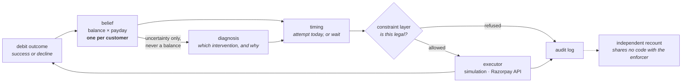

# UPI AutoPay Recovery Agent

**An agent that decides *when* to retry a failed subscription debit, by tracking
a probability distribution over the customer's bank balance and over the day
their salary arrives.**

Indian subscription payments run on UPI AutoPay: a mandate authorises a merchant
to debit a customer once per billing cycle, and when the account is short at
that exact moment the debit is declined. The standard answer is a fixed retry
schedule — Razorpay documents charge on day T, then retry on T+1, T+2 and T+3,
then halt — which spends every permitted attempt inside a four-day window that
is often still before the customer is paid. Worse, it spends them: an attempt
is capped at four per cycle, and a mandate that *fails* all four dies,
forfeiting every billing cycle it had left.

This project treats each decline as a measurement. A failed ₹550 debit says the
balance was under ₹550 at that moment; a successful one says it was at least
₹550. Those observations update a belief about the balance and about which day
of the cycle the salary lands, and the agent schedules the next attempt for the
day with the best remaining chance of clearing. Every proposed money action
passes a constraint layer that enforces NPCI's mandate rules before execution,
and every decision — including the decision to wait — is appended to an audit
log.

| | agent | fixed schedule | |
|---|---|---|---|
| Billing cycles collected | **94.36%** | — | `agent.batch_report` |
| Recovered across the batch | **₹5,994,430** | — | `agent.batch_report` |
| Of the debits that would fail on their due date, share recovered | **90.55%** | 16.35% | `test_recovery_rates` |
| Mandates still alive after 120 days | **97.2%** | 32.1% | `test_recovery_rates` |

*Two experiments, named so they are not mistaken for one. The first two rows are
100 customers × 5 mandates over **4** held-out populations; the last two are the
same design over **8**. Both at 120 days, payday known to ±7 days, and both at
the repository's default calibration `pop_spend=1.05` — which is a hard world,
and the next section is about what happens at a realistic one. The simple
payday-timing baseline `payday_wait` collects 57.70% of cycles, +36.66 points
behind the agent (2 SE 2.47).*

> **Every result here comes from a simulation.** No Razorpay transaction,
> mandate or decline code has been observed by this project. The next section is
> about how much that should worry you.

**Interactive demo.** [`docs/index.html`](docs/index.html) walks through one
customer's month, the timing decision day by day, a rail outage, and the cases
where the simple baseline wins. Static page, no build step:
`python -m http.server --directory docs`.

---

## Does the simulation resemble reality?

There is **no public benchmark** for payment retry scheduling — no shared
dataset, no held-out set, no leaderboard. What exists is a set of aggregate
statistics published by companies that sell recovery software. They are
second-hand, they aggregate non-comparable customer bases, and one states in its
own methodology note that its figures are ranges rather than laws.

They are still useful for one reason: **this project did not fit to them.** The
world is calibrated against a single anchor. Everything below is scored, not
tuned.

| | measured | published | |
|---|---|---|---|
| Share of debits failing on their due date | **13.68%** | 8–15% | **hit** |
| Recovery under a fixed-interval retry schedule | **27.85%** | 20–40% | **hit** |
| Recovery under smart retry timing | 97.38% | 70–85% | miss — too high |
| Share of recoveries landing inside 10 days | 41.84% | 85–95% | miss — too slow |

*8 held-out populations at `pop_spend=0.80` — a gentler world than the default,
chosen because it is the one whose failure rate matches the published record.
The same script prints the `1.05` rows quoted at the top. Reproduce with
`python agent/tests/test_recovery_rates.py`. Sources in
[`docs/01_FACTS.md`](docs/01_FACTS.md).*

Two independent bands hit at the same calibration. The first is a property of
the world; the second is a property of a baseline policy running inside it —
different parts of the model, agreeing with the outside record together.

**The two misses have two different causes**, and both are properties of the
world rather than of the agent:

- **Recovery is too high** because no simulated customer is ever simply unable
  to pay — a clairvoyant scheduler collects 100% at every calibration tested.
- **Recovery is too slow** because a mandate's due date and its customer's
  payday are drawn independently, so the wait between them averages half a
  cycle. Only **35.8%** of at-risk cycles have money inside ten days, and the
  agent recovers **42.6%** of them inside ten days — it is already beating the
  ceiling this world sets. Real billing dates cluster near paydays; these do not.

Both are being fixed, separately
([`docs/04_BUILD_PLAN.md`](docs/04_BUILD_PLAN.md), W2 and W6).

**The headline is conditional on how hard the world is**, and that is swept
rather than assumed. `pop_spend` sets how much of a salary a customer spends per
cycle:

| `pop_spend` | baseline per-attempt approval | agent − baseline |
|---|---|---|
| 0.60 | 93.2% | +3.51 ±0.88 |
| **0.80** | **84.6%** | **+6.29 ±1.42** |
| 0.90 | 66.2% | +14.73 ±1.83 |
| 1.05 | 39.7% | +36.43 ±3.37 |

*Due-date failure is measured at the two calibrations the recovery study covers:
**13.68%** at 0.80 and **68.71%** at 1.05.*

At 0.80 — the setting that matches the published failure rate — the agent is
worth **+6.29 points**, which sits inside the 6–8% uplift published as the
industry benchmark for retry optimisation. Nothing was tuned to land there. The
larger numbers come from a harsher world, and quoting them without this table
would be quoting the top of a range. Reproduce with
`python scripts/spend_sweep.py`.

## Quickstart

```bash
pip install numpy==2.4.2
python -m agent.batch_report --pops 4
```

**~50 seconds. No API key, no network, no model download.**

It runs the agent over four populations of 100 customers, prints the headline
with the baseline beside it, and then prints the things that are easy to claim
and hard to show. Every stopping rule that fired, grouped:

```
STOPPING RULES THAT FIRED, grouped by rule
  agent, deterministic
     COLLECTED             6172
     CYCLE_CLOSED           675
     ESCALATED               45
     AGENT_STOP               4
     MANDATE_DEAD             3
```

Every constraint refusal, counted twice — once by the gate that refuses, and
once by an auditor that rebuilds legality from the log alone and is forbidden
from importing the gate:

```
                   arm        rule  gate refused  auditor found  agree?
  agent, deterministic         cap             0              0     yes
  agent, deterministic        peak             0              0     yes
  agent, deterministic        lead             0              0     yes
  agent, deterministic     pending             0              0     yes
  agent, deterministic   represent             0              0     yes
                             TOTAL             0              0     yes   over 8954 executed money actions
```

And the full chain behind one recovered payment, which is what querying the
audit trail by `action_id` returns:

```
  action_id b9798daaff4e2c93   mandate c11m1
  WHAT THE BELIEF THOUGHT
     p(success) now 0.3114, best later 0.3081, index score +17.60  -> ok
  WHAT THE DIAGNOSER SAID, AND WHY
     root cause   INSUFFICIENT_FUNDS
     intervention RETRY  confidence 0.7
     source       fallback  prompt det-rules-v1
     rationale    Proceeding with the attempt our timing model scores highest…
     governance   ok=True
  ALL FIVE CONSTRAINT VERDICTS
     cap PASS   peak PASS   lead PASS   pending PASS   represent PASS
  THE MONEY ACTION
     Rs 630.00 at t=56 (day 2, hour 08), notified t=32, gate=ALLOWED
  THE OUTCOME
     OK  success=True  recovered Rs 630.00
```

The trail for that run is 29,671 events in
`agent/runs/batch_report_chain.jsonl`, one row per event, append-only.

Two more, both offline:

```bash
python scripts/prove_stage0_refuses.py
```

The constraint layer refusing an illegal debit against the *real* Razorpay
client, with the network transport rigged to raise if it is ever reached — then
an action injected below the gate, caught by the auditor from the log alone.

```bash
python agent/eval/run_eval.py --llm --judge --replay
```

The diagnosis eval replayed from committed response caches. 0.5s, $0.00.

> **If `import numpy` fails, the interpreter is wrong rather than the dependency
> list.** On Windows with msys2 on `PATH`, `python` can resolve to a build with
> neither numpy nor pip. `sim/gate.py` and the git hooks probe for an
> interpreter that can import numpy instead of trusting the name.

## How it works

Once a day, for every live mandate:

1. **Track the belief.** One probability distribution per *customer*, covering
   the balance and which day of the 30-day cycle the salary lands. All of a
   customer's mandates share it, so an outcome on one subscription informs the
   timing of the others. That sharing is worth **+9.53 points** and is the
   argument for running this at an aggregator rather than a merchant.
2. **Score today against later.** The belief gives the probability a debit
   clears today, and the best probability available on any remaining day of the
   cycle. A negative index score means waiting is worth more, which it is on
   most days.
3. **Diagnose the failure.** A language model names a root cause and picks an
   intervention — retry, nudge, escalate or stop — falling back to a
   deterministic rule engine on any failure.
4. **Check the action is legal.** Five NPCI rules: at most four attempts per
   mandate per cycle, no execution during peak hours, at least 24 hours between
   the pre-debit notification and the debit, one pending notification per
   mandate, and no re-presentation of an insufficient-funds decline under the
   old notification.
5. **Execute or refuse.** Refused actions never reach an executor. The executor
   is an interface with two implementations: the simulation, and Razorpay's
   live API.
6. **Fold the outcome back in**, success or decline.
7. **Log everything**, including the days it decided to do nothing.



Two boundaries are enforced in code, and each has a test behind it.

**The language model never chooses when to debit.** It diagnoses why a payment
failed and picks among interventions. The type it returns has no field in which
a time could be expressed, and an import-graph test stops that layer from
reaching the belief, the timing code, the constraint layer or the world.

**The constraint layer refuses; a separate auditor recounts.** They measure
different things — the gate counts what it stopped, the auditor counts what
illegally happened. `scripts/prove_stage0_refuses.py` shows the difference by
moving money below the gate and watching the auditor catch it.

## Results

Everything turns on how accurately payday can be estimated in advance.
`payday_wait` — the baseline throughout — estimates the payday, waits for it,
then attempts once a day. A few lines of code, and a strong comparator when the
estimate is good.

*n=100, 8 held-out populations (seeds 700–707), 120 days, paired 2 SE.
Reproduce with `python sim/headline.py`.*

| Payday known to | `payday_wait` | This agent | Difference |
|---|---|---|---|
| ±1 day | **99.24%** | 95.73% | −3.51 ±0.36 — baseline wins |
| ±3 days | 94.65% | **95.82%** | +1.17 ±1.35 — not significant |
| ±5 days | 72.18% | **95.82%** | +23.64 ±2.61 |
| ±7 days | 59.14% | **95.57%** | +36.43 ±3.37 |
| ±10 days | 48.11% | **95.62%** | +47.50 ±3.17 |
| ±14 days | 40.01% | **93.16%** | +53.15 ±2.90 |

The crossover sits between ±3 and ±5 days. Below it the baseline is the better
tool. Above it the baseline degrades sharply while the learned policy holds
between 93% and 96%, because it recovers the payday from observed outcomes
rather than trusting the estimate it was handed. **How accurately payday can
actually be estimated in India is not known** — no measurement of it was found,
which is why the agent learns it online and reports its own uncertainty.

**Why the fixed schedule does so badly is worth stating plainly.** It spends all
four attempts within four days of the due date, hits the NPCI cap while the
account is still empty, and the mandate dies — forfeiting every remaining
billing cycle. Survival falls to 32.1%, against the agent's 97.2%. Dunning
harder costs the customer, and the metric prices that directly: a dead mandate
forfeits its remaining cycles, so no assumed lifetime value is needed.

Two further measured results:

- **The agent's own action space is worth +1.371 points** at 120 days, entirely
  by holding back a final attempt to prevent mandate death. It is +0.563 at 60
  days and +1.790 at 180, so it is a curve over the horizon, not a constant.
- **Outage detection is a capability, not a recovery number.** Pooling every
  merchant's outcomes, the agent detects a degraded UPI rail with a false-alarm
  rate of 0 of 48 runs and a true-positive rate of 1.00 at n≥100. A single
  merchant sees 0.38 attempts per 24-hour window against a floor of 8 and cannot
  evaluate the statistic at all. Acting on it is a different question: pausing
  dispatch measured **−0.529 points**, so it does not ship as a default.

Full experimental design and bias analysis:
[`docs/02_RESULTS.md`](docs/02_RESULTS.md).

## Two decline states from Razorpay's error list

Razorpay does not return NPCI's decline codes — it normalises them into 110
error reasons of its own. Mapping one onto the other surfaced two states this
project's taxonomy had no name for, and both change the correct action.

**`funds_blocked_by_mandate`** — the money is there, and another mandate has
already claimed it. Retrying is wrong, and a merchant seeing only its own debits
cannot tell it apart from an empty account.

**`deemed_transaction`** — the response was lost, so whether the debit went
through is unknown and the customer may already have been charged. Retrying
risks a double debit. No timing score can express this: there is no combination
of "probability now" and "probability later" that means *do not act, because the
question is unanswerable*.

Both are routed by the diagnosis layer. **Neither is simulated and neither
carries a frequency** — no source gives a rate for either. Details:
[`docs/03_ERRORS.md`](docs/03_ERRORS.md).

## What is simulated

**Simulated.** Customer balances, salary dates and spending; debit outcomes;
outage scenarios; the merchant population; and every percentage and rupee total
in this repository.

**From published sources.** NPCI's five mandate execution rules and decline code
list; Razorpay's error reasons, documented retry schedule, Payment Downtime API
shape and payment error surface. Every external claim carries a source tag in
[`docs/01_FACTS.md`](docs/01_FACTS.md); anything not in that file is not
established.

**Not known.** Real AutoPay decline frequencies. How accurately payday can be
predicted in India. Whether an aggregator may lawfully use one merchant's
outcomes to schedule another's debit for the same customer. Whether Razorpay's
API accepts the request bodies in `agent/execution/razorpay_executor.py`, which
are derived from documentation and have never been sent.

## Limitations

- **No real data, at any point.** The world is tuned so a documented retry
  schedule reproduces a plausible approval rate. Every absolute percentage
  inherits that calibration.
- **No simulated customer is ever unable to pay.** A clairvoyant scheduler
  collects 100%, so the agent solves a pure timing problem and never a
  collectability one. This is the largest gap and is being closed next.
- **The headline batch runs with the richer decline taxonomy switched off** — no
  frozen accounts, revoked mandates or limit hits. Switching it on costs between
  0 and 13.5 points, and every rate in that sweep is a guess.
- **The largest single sensitivity is a guessed constant.** How often a debit is
  refused by a transaction or mandate limit is published nowhere; sweeping it
  over 0.00 / 0.05 / 0.15 costs 0.00 / −2.87 / −13.46 points, and the curve is
  steeply non-linear.
- **Two of the five constraint rules have no working test in the simulation** —
  the attempt cap and the pending-notification rule. Both are enforced and
  tested inside `agent/`, and those are the only working tests either has.
- **The documented retry schedule cannot be executed compliantly at all.** With
  a 24-hour notification requirement the earliest legal presentation is T+1, so
  the compliant rendering is T+1…T+4. The same constraint means this agent
  forfeits the due date on every mandate, which is a defect it has not fixed.
- **The legal status of cross-merchant pooling is unresolved**, and it underpins
  the strongest claim here.
- **Six of twenty-five simulation gates are red on a clean checkout**, on
  purpose, each with a written reason in `sim/known_failures.txt`. A gate that no
  deliberate mutation can trip is treated as a failure, because a test nothing
  can break is not evidence.
- **The study is small.** n=100, 8 populations, one run seed each.
- **The language model is mostly bypassed in the batch.** The loop asks for a
  diagnosis 119,667 times and runs under a hard cap on network calls, giving a
  94.8% fallback rate. The LLM arm is 95% deterministic and is not "the model's
  number".

## Repository map

| Path | What is there |
|---|---|
| [`docs/06_MODEL_CARD.md`](docs/06_MODEL_CARD.md) | What ships, what it is worth, and eleven things it was never tested on. Read before quoting a number. |
| [`docs/02_RESULTS.md`](docs/02_RESULTS.md) | Every result, with its experimental design and bias analysis |
| [`docs/04_BUILD_PLAN.md`](docs/04_BUILD_PLAN.md) | What is being built next, and the validation suite |
| [`docs/03_ERRORS.md`](docs/03_ERRORS.md) | Twenty-six errors found in this project's own work, with the mechanism and the guard added for each |
| [`docs/01_FACTS.md`](docs/01_FACTS.md) | Every external fact, with a source and a confidence tag |
| [`docs/07_AGENT_BRIEF.md`](docs/07_AGENT_BRIEF.md) | The interface between the agent and the simulation |
| [`NOTES.md`](NOTES.md) | The decision log, append-only and unedited |
| `agent/` | Policy, constraints, context, execution, LLM layer, audit trail, eval |
| `sim/` | The simulated world, the belief filters and the 25-gate suite |
| `scripts/` | Page data, the constraint-layer demonstration, the calibration sweep, git hooks |

## Running the tests

```bash
python sim/gate.py --tier fast
```

```bash
python sim/gate.py --tier full
```

The fast tier (~35s idle) checks the code still behaves the same way; the full
tier (~100s idle) adds the statistical gates. Both roughly double if the machine
is busy — the suite saturates eight worker processes.

The agent's own gates run individually:

```bash
python agent/tests/test_stage0_enforces.py      # the constraint layer, 20/20
python agent/tests/test_parity_vs_harness.py    # agent == simulation, bit-exact
python agent/tests/test_recovery_metric.py      # the recovery metric, 5 mutants
```

Install the git hooks once per clone with `scripts/install-hooks.sh`; `git
commit` then runs the fast tier and `git push` runs the full tier.

---

Built for Razorpay's AI Buildathon, Track 3.
