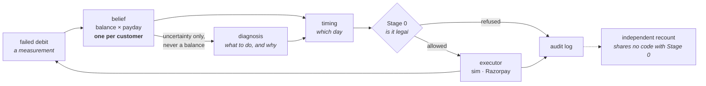

# A recovery agent for UPI AutoPay

Seven in ten Indian subscription debits fail, and almost always for the same
reason: the account is empty at the exact moment the mandate fires. The money
usually arrives a few days later and nobody is watching for it.

This agent keeps a probability distribution over each customer's bank balance
**and** over the day their salary lands, updates both from every failed debit —
a decline is a measurement, not just a loss — and schedules the next attempt for
when the money is likely to be there. Every attempt passes through a constraint
layer that refuses illegal actions rather than recording them, and every
decision including the decision to wait is appended to an audit log. A language
model diagnoses why a debit failed and picks what to do about it. It never
picks when to debit.

**94.36% of billing cycles collected, against `payday_wait`'s 57.70%.**
+36.66 points (2 SE 2.47), ₹59,94,430 recovered, zero constraint refusals with
an independent recount of zero across 8,954 money actions.

`payday_wait` is the five-line heuristic a good rival team builds in an
afternoon: wait for the estimated payday, then one attempt a day. It sits beside
our number everywhere in this repo, because **at ±1 day of payday uncertainty it
beats us by 3.5 points.** The argument is not that we are better on average. It
is the shape: across payday uncertainty from ±1 to ±10 days the heuristic falls
from 99% to 48% and this agent stays between 95% and 96%. It does not care how
wrong the estimate is. Below about four days of uncertainty, build the
heuristic instead.

**See it move: `<GITHUB-PAGES-URL>`** — one customer's month, two timelines, and
the three things that change the answer. Serve it locally with
`python -m http.server --directory docs`; on GitHub, Pages -> Deploy from
branch -> `/docs`. *(This link is a placeholder until the repo is public.)*

## Run it

```bash
pip install numpy==2.4.2 && python -m agent.batch_report --pops 4
```

That reproduces the number above from a fresh clone in about fifty seconds and
needs nothing else — no API key, no model download, no network. Tested on a
clean tree, not read off the page. Add `--llm` for the model overlay, which
needs a Z.ai key in `.env` and does not change the money.

## How it works

A billing cycle opens and the agent asks, once a day, whether today is the best
remaining day to attempt this debit. The belief filter answers with the
probability the account clears the amount today and the best probability
available later in the cycle, and an index score decides between them — a
negative score means waiting is worth more, which is most days. When it does
decide to act, the diagnosis layer names a root cause and an intervention, and
the constraint layer adjudicates all five NPCI rules and either executes or
refuses. The outcome, success or decline, is folded back into the filter as
evidence about both the balance and the payday. One filter is shared by all
five of a customer's mandates, which is where the advantage comes from: a single
merchant sees one debit a month on an account and an aggregator sees five.
Nothing else in the system holds an executor, so nothing else can move money.



## What is real, what is simulated, what we would need from Razorpay

**Simulated.** Everything with a percentage on it. No Razorpay transaction,
mandate or decline code has ever been observed by this project. The world, the
policies and the tests were written by one party, which is the failure mode this
repo has caught itself in twenty-six times and written up each time.

**Real.** The five constraints come from NPCI's published rules. The decline
families come from NPCI's error code list, and the mapping into Razorpay's own
110 error reasons is built against the list they publish, committed verbatim.
Their documented
subscription retry schedule — charge on T, retry T+1, T+2, T+3, then halt — is
what the naive comparator on the live page actually does, so the thing we beat
is the thing they document.

**Two states their error list has and our taxonomy did not.**
`funds_blocked_by_mandate` means the money is there and another mandate has
already claimed it — cross-merchant contention, in the production vocabulary of
a payment aggregator, and invisible to a merchant who can only see their own
debits. `deemed_transaction` means nobody knows whether the debit went through,
so a retry may charge the customer twice. Both now have families and neither has
a number, because the frozen world models neither and inventing a rate would be
decorating a story.

**Needed from Razorpay.** Whether an aggregator may lawfully use one merchant's
outcomes to schedule another's debit for the same customer — that is the legal
basis for the central claim here and it is unresolved. How accurately payday can
actually be estimated in India, because the crossover against the heuristic sits
between ±3 and ±5 days and nobody has measured which side reality is on. And
AutoPay-specific decline frequencies, which no public source gives; the largest
single sensitivity in the system is a limit-decline rate that is a pure guess.

## Where to look next

| | |
|---|---|
| [`docs/06_MODEL_CARD.md`](docs/06_MODEL_CARD.md) | What ships, what it is worth, and eleven things it has never been tested on |
| [`docs/02_RESULTS.md`](docs/02_RESULTS.md) | Every number, with its design, its bias risks and whether a gate protects it |
| [`docs/03_ERRORS.md`](docs/03_ERRORS.md) | Twenty-six errors with mechanisms and guards. Start here if you have ten minutes |
| [`docs/07_AGENT_BRIEF.md`](docs/07_AGENT_BRIEF.md) | The interface, and the three mistakes that would cost the project |
| [`docs/01_FACTS.md`](docs/01_FACTS.md) | Every external fact with a source tag. Nothing outside this file is established |
| [`NOTES.md`](NOTES.md) | The decision log, unedited |

## Proving the constraint layer

```bash
python scripts/prove_stage0_refuses.py
```

Submits a debit inside an NPCI peak window, against the real Razorpay client,
and shows it refused before a single network call is made — the transport
raises if anything reaches it. Then it moves money *below* the gate and shows
the independent auditor catching that from the log alone, using code forbidden
by an import gate from touching the enforcer. No API key required, because the
refusal happens above the transport.

Worth knowing what those two counts are: the gate counts what it stopped, the
auditor counts what illegally happened. When both read zero in a batch report
they agree because nothing illegal happened — not because two implementations
checked each other. The auditor only bites when the gate fails, which is why
the script makes it fail.

## Caveats you should read before quoting anything

Six of twenty-five gates are red on a clean checkout, on purpose, and
`sim/known_failures.txt` says why for each. Two of the five constraint rules
have no working test in the simulation — the attempt cap and the pending
notification — so neither is claimed as a compliance guarantee; the agent
enforces and tests both itself, and that is the only working test either has
anywhere. The batch runs with the decline taxonomy switched off, which is the
world without frozen accounts or limit hits, and switching it on costs between
0 and 13.5 points against rates that are guesses.
